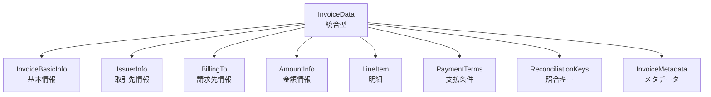
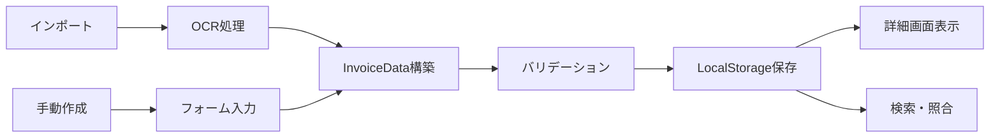

# 請求書データ型定義アーキテクチャ設計書

## 📋 概要

請求書管理システムにおける包括的なデータ型定義の設計書。既存の[`Invoice`](../lib/types.ts:31)型を8つのカテゴリーで再構成し、型安全性、保守性、拡張性を向上させる。

**ステータス**: 設計完了・実装待ち  
**作成日**: 2025-11-23  
**バージョン**: 2.0.0

---

## 🎯 設計目的

### 解決すべき課題

1. **型定義の散在**: 請求書関連の情報が複数の型に分散している
2. **null安全性の不足**: オプショナルフィールドの扱いが不明瞭
3. **インポートデータの特殊性**: 手動作成とインポートデータで必要な情報が異なる
4. **照合機能の欠如**: 重複チェックや自動マッチングのための型定義がない

### 設計方針

1. **カテゴリーによる整理**: 8つの明確なカテゴリーで情報を分類
2. **既存型との互換性**: 段階的な移行を可能にする
3. **null安全性の向上**: 必須/オプショナルを明確に区別
4. **拡張性の確保**: 将来の機能追加に対応できる柔軟な設計

---

## 🏗️ アーキテクチャ概要

### 型定義の階層構造



### データフロー



---

## 📐 型定義詳細

### 1. InvoiceBasicInfo - 基本情報

請求書の識別と日付に関する基本的な情報。

```typescript
/**
 * 請求書基本情報
 * 
 * 請求書を一意に識別し、取引の時系列を管理するための情報。
 * インボイス制度対応のため、通貨フィールドも含む。
 */
export interface InvoiceBasicInfo {
  /**
   * 請求書番号
   * 形式は発行元により異なる（例: "INV-2023-001", "202311-123"）
   * null の場合はシステムが自動採番
   */
  invoiceNumber: string | null

  /**
   * 発行日
   * ISO 8601形式の日付文字列（例: "2023-11-15"）
   * null の場合は未確定（下書き状態）
   */
  issueDate: string | null

  /**
   * 取引日
   * 実際の商品・サービス提供日
   * null の場合は発行日と同一とみなす
   */
  transactionDate: string | null

  /**
   * 通貨コード
   * ISO 4217形式（例: "JPY", "USD", "EUR"）
   * @default "JPY"
   */
  currency: string

  /**
   * 件名・タイトル
   * 請求書の概要（例: "2023年11月分請求書", "システム開発費用"）
   */
  subject: string | null

  /**
   * 発注番号・注文番号
   * 照合用の参照番号
   */
  orderNumber: string | null
}
```

**設計意図**:
- `invoiceNumber`は自動採番にも対応するため null 許容
- 日付は Date 型ではなく string 型を使用（LocalStorage保存とシリアライズの簡素化）
- `currency`はデフォルト値を持つが、将来の国際化対応のため明示的に保持

---

### 2. IssuerInfo - 取引先情報（発行元）

請求書を発行した企業・個人の情報。インポートデータで特に重要。

```typescript
/**
 * 発行元情報
 * 
 * インポートされた請求書の発行元企業情報。
 * 手動作成の場合は settings.company を使用するため、このフィールドは undefined。
 */
export interface IssuerInfo {
  /**
   * 企業名・個人名（必須）
   */
  companyName: string

  /**
   * 適格請求書発行事業者登録番号
   * インボイス制度対応（T + 13桁の数字）
   * 例: "T1234567890123"
   */
  registrationNumber: string | null

  /**
   * 住所
   * 都道府県から始まる完全な住所
   */
  address: string | null

  /**
   * 電話番号
   * ハイフン区切り形式（例: "03-1234-5678"）
   */
  phone: string | null

  /**
   * メールアドレス
   */
  email: string | null

  /**
   * 担当者名
   */
  contactPerson: string | null
}
```

**設計意図**:
- [`lib/types.ts:124`](../lib/types.ts:124)の既存の`IssuerInfo`を拡張
- `companyName`のみ必須、他はオプショナル
- OCR抽出時の信頼度は`InvoiceMetadata`で管理

---

### 3. BillingTo - 請求先情報

請求書の宛先情報。手動作成時はClientから、インポート時はOCRから取得。

```typescript
/**
 * 請求先情報
 * 
 * 請求書の宛先。既存の Client 型と連携するが、
 * より軽量な構造で請求書データに埋め込む。
 */
export interface BillingTo {
  /**
   * 請求先企業名・個人名（必須）
   */
  companyName: string

  /**
   * 部署名
   * 例: "経理部", "総務課"
   */
  department: string | null

  /**
   * 担当者名
   * 例: "山田太郎様", "田中花子 御中"
   */
  contactPerson: string | null
}
```

**設計意図**:
- 既存の[`Client`](../lib/types.ts:17)型とは別に、請求書埋め込み用の軽量版を定義
- `Client`型の id への参照は`InvoiceMetadata`で管理
- 最小限の情報で請求書表示に必要な情報を保持

---

### 4. AmountInfo - 金額情報

請求書の金額計算結果と税金情報。

```typescript
/**
 * 税額内訳
 * 複数税率対応のための詳細情報
 */
export interface TaxBreakdown {
  /**
   * 税率（%）
   * 例: 10, 8, 0
   */
  rate: number

  /**
   * その税率での税額
   */
  amount: number

  /**
   * その税率が適用される課税対象額（オプション）
   */
  taxableAmount?: number
}

/**
 * 金額情報
 * 
 * 請求書の金額計算結果。
 * 小計、税額、合計の3つの基本値と、詳細な税額内訳を保持。
 */
export interface AmountInfo {
  /**
   * 小計（税抜金額）
   */
  subtotal: number

  /**
   * 消費税額
   */
  taxAmount: number

  /**
   * 合計金額（税込）
   * subtotal + taxAmount と一致する必要がある
   */
  totalAmount: number

  /**
   * 税額内訳（複数税率対応）
   * 例: [{ rate: 10, amount: 1000 }, { rate: 8, amount: 80 }]
   */
  taxBreakdown: TaxBreakdown[]

  /**
   * 免税取引フラグ
   * true の場合、taxAmount は 0 である必要がある
   */
  taxExempt: boolean
}
```

**設計意図**:
- 複数税率（軽減税率8%、標準税率10%）に対応
- 金額の整合性チェックが可能な構造
- `taxBreakdown`で詳細な税額内訳を保持

---

### 5. LineItem - 明細

請求書の個別明細行。商品・サービスごとの詳細情報。

```typescript
/**
 * 明細行
 * 
 * 請求書の個別項目。
 * 既存の InvoiceLineItem を拡張し、税率・税額を追加。
 */
export interface LineItem {
  /**
   * 明細ID
   * システム内で一意に識別するための ID
   */
  id: string

  /**
   * 品名・サービス名（必須）
   * 例: "Webサイト制作", "SNS運用(10月分)"
   */
  description: string

  /**
   * 数量
   * null の場合は「一式」として扱う
   */
  quantity: number | null

  /**
   * 単位
   * 例: "個", "時間", "式", "月"
   */
  unit: string | null

  /**
   * 単価
   * null の場合は amount のみで計算
   */
  unitPrice: number | null

  /**
   * 金額（税抜）
   * quantity * unitPrice と一致する必要がある
   * （quantity または unitPrice が null の場合は直接設定）
   */
  amount: number

  /**
   * 適用税率（%）
   * 例: 10, 8, 0
   * null の場合はデフォルト税率を適用
   */
  taxRate: number | null

  /**
   * 税額
   * amount * (taxRate / 100) と一致する必要がある
   */
  taxAmount: number | null

  /**
   * 備考
   * この明細行に関する追加情報
   */
  remarks: string | null
}
```

**設計意図**:
- 既存の[`InvoiceLineItem`](../lib/types.ts:8)を拡張
- `taxRate`と`taxAmount`を追加し、明細ごとの税計算に対応
- `unit`フィールドで柔軟な単位表現を可能に

---

### 6. PaymentTerms - 支払条件

支払期限と振込先情報。

```typescript
/**
 * 支払条件
 * 
 * 支払期限と振込先口座情報。
 * 既存の PaymentInfo を拡張し、支払条件も含める。
 */
export interface PaymentTerms {
  /**
   * 支払期日
   * ISO 8601形式の日付文字列（例: "2023-12-31"）
   */
  dueDate: string | null

  /**
   * 支払条件
   * 例: "翌月末払い", "NET30", "現金払い"
   */
  paymentCondition: string | null

  /**
   * 銀行名
   * 例: "三菱UFJ銀行"
   */
  bankName: string | null

  /**
   * 支店名
   * 例: "渋谷支店"
   */
  branchName: string | null

  /**
   * 口座種別
   * 例: "普通預金", "当座預金"
   */
  accountType: string | null

  /**
   * 口座番号
   * 例: "1234567"
   */
  accountNumber: string | null

  /**
   * 口座名義
   * 例: "カ)サンプルカイシャ"
   */
  accountHolder: string | null

  /**
   * 振込手数料負担
   * 例: "振込手数料は貴社負担でお願いします"
   */
  feeBearer: string | null
}
```

**設計意図**:
- 既存の[`PaymentInfo`](../lib/types.ts:104)を拡張
- `dueDate`と`paymentCondition`を追加し、支払条件を明確化
- `feeBearer`で手数料負担の取り決めを記録

---

### 7. ReconciliationKeys - 照合キー

請求書の重複チェックと自動マッチングのためのキー情報。

```typescript
/**
 * 請求期間
 */
export interface BillingPeriod {
  /**
   * 期間開始日
   * ISO 8601形式（例: "2023-11-01"）
   */
  start: string | null

  /**
   * 期間終了日
   * ISO 8601形式（例: "2023-11-30"）
   */
  end: string | null
}

/**
 * 照合キー
 * 
 * 請求書の重複チェックと自動マッチングのための情報。
 * 同一の請求書を複数回インポートした場合の検出や、
 * 発注書との突合に使用。
 */
export interface ReconciliationKeys {
  /**
   * 正規化された発行元名
   * 
   * 株式会社、スペース等を除去した標準形式。
   * 例: "サンプル" ← "株式会社サンプル", "サンプル　株式会社"
   */
  normalizedIssuerName: string

  /**
   * 発注番号・注文番号
   * InvoiceBasicInfo.orderNumber と同じ値
   */
  orderNumber: string | null

  /**
   * 請求期間
   * 例: { start: "2023-11-01", end: "2023-11-30" }
   */
  billingPeriod: BillingPeriod

  /**
   * 合計金額
   * 照合時の金額チェック用
   */
  totalAmount: number

  /**
   * プロジェクト名・案件名
   * OCRまたは手動で設定
   */
  projectName: string | null

  /**
   * 担当者名
   * 発行元側の担当者
   */
  contactPerson: string | null
}
```

**設計意図**:
- 重複チェックアルゴリズムで使用するキー情報を集約
- `normalizedIssuerName`で企業名のゆらぎに対応
- `billingPeriod`で期間ベースの照合を可能に

**照合アルゴリズム例**:

```typescript
/**
 * 請求書の重複判定
 */
function isDuplicate(invoice1: InvoiceData, invoice2: InvoiceData): boolean {
  const keys1 = invoice1.reconciliationKeys
  const keys2 = invoice2.reconciliationKeys
  
  // 発行元名が一致
  if (keys1.normalizedIssuerName !== keys2.normalizedIssuerName) {
    return false
  }
  
  // 金額が一致
  if (keys1.totalAmount !== keys2.totalAmount) {
    return false
  }
  
  // 請求期間が一致
  if (keys1.billingPeriod.start === keys2.billingPeriod.start &&
      keys1.billingPeriod.end === keys2.billingPeriod.end) {
    return true
  }
  
  // 発注番号が一致
  if (keys1.orderNumber && keys2.orderNumber &&
      keys1.orderNumber === keys2.orderNumber) {
    return true
  }
  
  return false
}
```

---

### 8. InvoiceMetadata - メタデータ

システム管理用のメタ情報。監査証跡とデータ管理に使用。

```typescript
/**
 * 受領方法
 */
export type ReceiptMethod = 'email' | 'upload'

/**
 * データソース
 * receiptMethod と組み合わせて使用
 */
export type InvoiceSource = 'manual' | 'pdf_import' | 'image_import'

/**
 * 請求書メタデータ
 * 
 * システム管理用の情報。
 * 監査証跡、データの出所、ファイル管理に関する情報を保持。
 */
export interface InvoiceMetadata {
  /**
   * 受領方法
   * - email: メール経由で受領
   * - upload: 手動アップロード
   */
  receiptMethod: ReceiptMethod

  /**
   * データソース
   * - manual: 手動作成
   * - pdf_import: PDFインポート
   * - image_import: 画像インポート
   */
  source: InvoiceSource

  /**
   * 受領日時
   * ISO 8601形式（例: "2023-11-15T10:30:00+09:00"）
   */
  receiptDateTime: string

  /**
   * 登録者
   * ユーザー識別子またはメールアドレス
   */
  registeredBy: string

  /**
   * 送信元メールアドレス
   * receiptMethod が 'email' の場合のみ設定
   */
  sourceEmail: string | null

  /**
   * ファイルハッシュ値
   * 元ファイルのSHA-256ハッシュ（重複検出用）
   */
  fileHash: string

  /**
   * ストレージパス
   * IndexedDB または LocalStorage のキー
   */
  storagePath: string

  /**
   * OCR信頼度
   * 0-1の範囲（インポートデータの場合のみ）
   */
  ocrConfidence: number

  /**
   * データバージョン
   * スキーマのバージョン番号
   * @default 2
   */
  version: number

  /**
   * 作成日時
   * ISO 8601形式
   */
  createdAt: string

  /**
   * 更新日時
   * ISO 8601形式
   */
  updatedAt: string

  /**
   * 読み取り専用フラグ
   * true の場合、編集不可（インポートデータ）
   */
  isReadonly: boolean

  /**
   * PDFストレージの場所
   * - 'indexeddb': IndexedDBに保存
   * - 'none': 保存なし
   */
  pdfStorageLocation?: 'indexeddb' | 'none'

  /**
   * 元のPDF添付ファイルID
   * InvoiceAttachment の id への参照
   */
  originalPdfAttachmentId?: string

  /**
   * 請求書ステータス
   */
  status: InvoiceStatus

  /**
   * 支払日
   * status が 'paid' の場合のみ設定
   */
  paidDate?: string

  /**
   * 備考・メモ
   */
  notes?: string

  /**
   * Client型へのID参照
   * BillingTo と紐づく Client レコードの ID
   */
  clientId?: string
}
```

**設計意図**:
- `receiptMethod`と`source`を分離し、受領経路とデータ形式を明確化
- 監査証跡のための日時情報を完備
- `fileHash`で重複ファイルのアップロードを検出
- 既存の`InvoiceStatus`等を統合

---

### 9. InvoiceData - 統合型

8つのカテゴリーを統合した最終的な型定義。

```typescript
/**
 * 請求書データ（統合型）
 * 
 * 8つのカテゴリーで構成される包括的な請求書データモデル。
 * 既存の Invoice 型を置き換える新しい型定義。
 * 
 * @version 2.0.0
 */
export interface InvoiceData {
  /**
   * システム内部ID
   * UUID v4 形式
   */
  id: string

  /**
   * 基本情報
   */
  basicInfo: InvoiceBasicInfo

  /**
   * 発行元情報（インポートデータの場合のみ）
   * 手動作成の場合は undefined で、settings.company を使用
   */
  issuerInfo?: IssuerInfo

  /**
   * 請求先情報
   */
  billingTo: BillingTo

  /**
   * 金額情報
   */
  amountInfo: AmountInfo

  /**
   * 明細行
   */
  lineItems: LineItem[]

  /**
   * 支払条件
   */
  paymentTerms: PaymentTerms

  /**
   * 照合キー
   */
  reconciliationKeys: ReconciliationKeys

  /**
   * メタデータ
   */
  metadata: InvoiceMetadata

  /**
   * 添付ファイル
   */
  attachments?: InvoiceAttachment[]

  /**
   * OCR抽出結果（インポートデータの場合のみ）
   */
  ocrData?: OCRResult
}
```

---

## 🔄 既存型との互換性

### マイグレーション戦略

#### Phase 1: 型定義の追加（破壊的変更なし）

```typescript
// lib/types.ts に新しい型を追加
export interface InvoiceBasicInfo { /* ... */ }
export interface BillingTo { /* ... */ }
export interface AmountInfo { /* ... */ }
export interface LineItem { /* ... */ }
export interface PaymentTerms { /* ... */ }
export interface ReconciliationKeys { /* ... */ }
export interface InvoiceMetadata { /* ... */ }
export interface InvoiceData { /* ... */ }
```

#### Phase 2: 変換関数の実装

```typescript
/**
 * 既存の Invoice 型から InvoiceData 型への変換
 */
export function migrateInvoiceToInvoiceData(invoice: Invoice): InvoiceData {
  return {
    id: invoice.id,
    
    basicInfo: {
      invoiceNumber: invoice.invoiceNumber,
      issueDate: invoice.issueDate.toISOString().split('T')[0],
      transactionDate: invoice.issueDate.toISOString().split('T')[0],
      currency: 'JPY',
      subject: invoice.notes || null,
      orderNumber: null,
    },
    
    issuerInfo: invoice.issuerInfo,
    
    billingTo: {
      companyName: invoice.client.name,
      department: null,
      contactPerson: invoice.client.contactPerson || null,
    },
    
    amountInfo: {
      subtotal: invoice.subtotal,
      taxAmount: invoice.tax,
      totalAmount: invoice.total,
      taxBreakdown: [{
        rate: invoice.taxRate,
        amount: invoice.tax,
      }],
      taxExempt: invoice.tax === 0,
    },
    
    lineItems: invoice.lineItems.map(item => ({
      id: item.id,
      description: item.description,
      quantity: item.quantity,
      unit: null,
      unitPrice: item.unitPrice,
      amount: item.amount,
      taxRate: invoice.taxRate,
      taxAmount: item.amount * (invoice.taxRate / 100),
      remarks: null,
    })),
    
    paymentTerms: {
      dueDate: invoice.dueDate.toISOString().split('T')[0],
      paymentCondition: null,
      bankName: invoice.paymentInfo?.bankName || null,
      branchName: invoice.paymentInfo?.branchName || null,
      accountType: invoice.paymentInfo?.accountType || null,
      accountNumber: invoice.paymentInfo?.accountNumber || null,
      accountHolder: invoice.paymentInfo?.accountHolder || null,
      feeBearer: null,
    },
    
    reconciliationKeys: {
      normalizedIssuerName: normalizeCompanyName(
        invoice.issuerInfo?.name || invoice.client.name
      ),
      orderNumber: null,
      billingPeriod: {
        start: null,
        end: null,
      },
      totalAmount: invoice.total,
      projectName: null,
      contactPerson: invoice.issuerInfo?.contactPerson || null,
    },
    
    metadata: {
      receiptMethod: invoice.source === 'manual' ? 'upload' : 'upload',
      source: invoice.source || 'manual',
      receiptDateTime: invoice.createdAt.toISOString(),
      registeredBy: 'system',
      sourceEmail: null,
      fileHash: '',
      storagePath: `invoices/${invoice.id}`,
      ocrConfidence: invoice.ocrData?.confidence || 0,
      version: 2,
      createdAt: invoice.createdAt.toISOString(),
      updatedAt: invoice.updatedAt.toISOString(),
      isReadonly: invoice.isReadonly || false,
      pdfStorageLocation: invoice.pdfStorageLocation,
      originalPdfAttachmentId: invoice.originalPdfAttachmentId,
      status: invoice.status,
      paidDate: invoice.paidDate?.toISOString().split('T')[0],
      notes: invoice.notes,
      clientId: invoice.client.id,
    },
    
    attachments: invoice.attachments,
    ocrData: invoice.ocrData,
  }
}

/**
 * InvoiceData 型から既存の Invoice 型への逆変換（後方互換性用）
 */
export function migrateInvoiceDataToInvoice(
  data: InvoiceData,
  client: Client
): Invoice {
  return {
    id: data.id,
    invoiceNumber: data.basicInfo.invoiceNumber || '',
    client,
    issueDate: new Date(data.basicInfo.issueDate || Date.now()),
    dueDate: new Date(data.paymentTerms.dueDate || Date.now()),
    lineItems: data.lineItems.map(item => ({
      id: item.id,
      description: item.description,
      quantity: item.quantity || 0,
      unitPrice: item.unitPrice || 0,
      amount: item.amount,
    })),
    subtotal: data.amountInfo.subtotal,
    tax: data.amountInfo.taxAmount,
    taxRate: data.amountInfo.taxBreakdown[0]?.rate || 10,
    total: data.amountInfo.totalAmount,
    status: data.metadata.status,
    paidDate: data.metadata.paidDate ? new Date(data.metadata.paidDate) : undefined,
    notes: data.metadata.notes,
    createdAt: new Date(data.metadata.createdAt),
    updatedAt: new Date(data.metadata.updatedAt),
    source: data.metadata.source,
    attachments: data.attachments,
    ocrData: data.ocrData,
    paymentInfo: {
      bankName: data.paymentTerms.bankName,
      branchName: data.paymentTerms.branchName,
      accountType: data.paymentTerms.accountType,
      accountNumber: data.paymentTerms.accountNumber,
      accountHolder: data.paymentTerms.accountHolder,
    },
    isReadonly: data.metadata.isReadonly,
    originalPdfAttachmentId: data.metadata.originalPdfAttachmentId,
    issuerInfo: data.issuerInfo,
    pdfStorageLocation: data.metadata.pdfStorageLocation,
  }
}

/**
 * 企業名の正規化
 */
function normalizeCompanyName(name: string): string {
  return name
    .replace(/株式会社|合同会社|有限会社|一般社団法人|公益社団法人/g, '')
    .replace(/\s+/g, '')
    .trim()
}
```

#### Phase 3: 段階的な置き換え

1. **新規作成**: 新しいインポート処理から`InvoiceData`を使用
2. **既存データ**: `migrateInvoiceToInvoiceData()`で変換
3. **UI層**: 両方の型に対応するビューコンポーネント
4. **最終移行**: すべてのデータを`InvoiceData`に統一

---

## 🎨 使用例

### 手動作成の場合

```typescript
const manualInvoice: InvoiceData = {
  id: uuidv4(),
  
  basicInfo: {
    invoiceNumber: 'INV-2023-001',
    issueDate: '2023-11-15',
    transactionDate: '2023-11-15',
    currency: 'JPY',
    subject: 'Webサイト制作費用',
    orderNumber: 'PO-2023-456',
  },
  
  issuerInfo: undefined, // 手動作成なので settings.company を使用
  
  billingTo: {
    companyName: '株式会社サンプル',
    department: '経理部',
    contactPerson: '山田太郎様',
  },
  
  amountInfo: {
    subtotal: 500000,
    taxAmount: 50000,
    totalAmount: 550000,
    taxBreakdown: [
      { rate: 10, amount: 50000, taxableAmount: 500000 },
    ],
    taxExempt: false,
  },
  
  lineItems: [
    {
      id: uuidv4(),
      description: 'トップページデザイン',
      quantity: 1,
      unit: '式',
      unitPrice: 200000,
      amount: 200000,
      taxRate: 10,
      taxAmount: 20000,
      remarks: null,
    },
    {
      id: uuidv4(),
      description: '下層ページ実装',
      quantity: 5,
      unit: 'ページ',
      unitPrice: 60000,
      amount: 300000,
      taxRate: 10,
      taxAmount: 30000,
      remarks: 'レスポンシブ対応含む',
    },
  ],
  
  paymentTerms: {
    dueDate: '2023-12-31',
    paymentCondition: '翌月末払い',
    bankName: '三菱UFJ銀行',
    branchName: '渋谷支店',
    accountType: '普通預金',
    accountNumber: '1234567',
    accountHolder: 'カ)マイカンパニー',
    feeBearer: '振込手数料は貴社負担',
  },
  
  reconciliationKeys: {
    normalizedIssuerName: 'サンプル',
    orderNumber: 'PO-2023-456',
    billingPeriod: {
      start: '2023-11-01',
      end: '2023-11-30',
    },
    totalAmount: 550000,
    projectName: 'コーポレートサイトリニューアル',
    contactPerson: null,
  },
  
  metadata: {
    receiptMethod: 'upload',
    source: 'manual',
    receiptDateTime: new Date().toISOString(),
    registeredBy: 'user@example.com',
    sourceEmail: null,
    fileHash: '',
    storagePath: 'invoices/...',
    ocrConfidence: 0,
    version: 2,
    createdAt: new Date().toISOString(),
    updatedAt: new Date().toISOString(),
    isReadonly: false,
    status: 'pending',
    clientId: 'client-uuid',
  },
  
  lineItems: [/* ... */],
  attachments: [],
}
```

### PDFインポートの場合

```typescript
const importedInvoice: InvoiceData = {
  id: uuidv4(),
  
  basicInfo: {
    invoiceNumber: '202311-123',
    issueDate: '2023-11-10',
    transactionDate: '2023-11-10',
    currency: 'JPY',
    subject: '2023年11月分請求書',
    orderNumber: null,
  },
  
  // OCRで抽出された発行元情報
  issuerInfo: {
    companyName: '株式会社テスト商事',
    registrationNumber: 'T1234567890123',
    address: '東京都千代田区千代田1-1-1',
    phone: '03-1234-5678',
    email: 'info@test.co.jp',
    contactPerson: '佐藤一郎',
  },
  
  billingTo: {
    companyName: '株式会社マイカンパニー',
    department: null,
    contactPerson: null,
  },
  
  amountInfo: {
    subtotal: 300000,
    taxAmount: 30000,
    totalAmount: 330000,
    taxBreakdown: [
      { rate: 10, amount: 30000 },
    ],
    taxExempt: false,
  },
  
  lineItems: [
    {
      id: uuidv4(),
      description: 'SNS運用(10月分)',
      quantity: null,
      unit: null,
      unitPrice: null,
      amount: 300000,
      taxRate: 10,
      taxAmount: 30000,
      remarks: null,
    },
  ],
  
  paymentTerms: {
    dueDate: '2023-12-10',
    paymentCondition: null,
    bankName: 'みずほ銀行',
    branchName: '東京支店',
    accountType: '普通預金',
    accountNumber: '9876543',
    accountHolder: 'カ)テストショウジ',
    feeBearer: null,
  },
  
  reconciliationKeys: {
    normalizedIssuerName: 'テスト商事',
    orderNumber: null,
    billingPeriod: {
      start: '2023-10-01',
      end: '2023-10-31',
    },
    totalAmount: 330000,
    projectName: 'SNS運用',
    contactPerson: '佐藤一郎',
  },
  
  metadata: {
    receiptMethod: 'upload',
    source: 'pdf_import',
    receiptDateTime: new Date().toISOString(),
    registeredBy: 'user@example.com',
    sourceEmail: null,
    fileHash: 'sha256-...',
    storagePath: 'invoices/...',
    ocrConfidence: 0.87,
    version: 2,
    createdAt: new Date().toISOString(),
    updatedAt: new Date().toISOString(),
    isReadonly: true,
    pdfStorageLocation: 'indexeddb',
    originalPdfAttachmentId: 'attachment-uuid',
    status: 'imported',
    clientId: undefined,
  },
  
  attachments: [
    {
      id: 'attachment-uuid',
      fileName: 'invoice_202311.pdf',
      fileType: 'application/pdf',
      fileSize: 524288,
      uploadedAt: new Date(),
    },
  ],
  
  ocrData: {
    confidence: 0.87,
    processingTime: 4500,
    extractedFields: {
      issuerName: { value: '株式会社テスト商事', confidence: 0.92 },
      issuerRegistrationNumber: { value: 'T1234567890123', confidence: 0.95 },
      // ...
    },
  },
}
```

---

## ✅ バリデーション

### 型レベルのバリデーション

```typescript
/**
 * InvoiceData のバリデーション
 */
export function validateInvoiceData(data: InvoiceData): {
  valid: boolean
  errors: string[]
} {
  const errors: string[] = []
  
  // 基本情報のバリデーション
  if (!data.basicInfo.currency) {
    errors.push('通貨コードは必須です')
  }
  
  // 金額の整合性チェック
  const calculatedTotal = data.amountInfo.subtotal + data.amountInfo.taxAmount
  if (Math.abs(calculatedTotal - data.amountInfo.totalAmount) > 0.01) {
    errors.push(
      `金額の整合性エラー: 小計${data.amountInfo.subtotal} + 税額${data.amountInfo.taxAmount} ≠ 合計${data.amountInfo.totalAmount}`
    )
  }
  
  // 税額内訳の合計チェック
  const taxBreakdownSum = data.amountInfo.taxBreakdown.reduce(
    (sum, breakdown) => sum + breakdown.amount,
    0
  )
  if (Math.abs(taxBreakdownSum - data.amountInfo.taxAmount) > 0.01) {
    errors.push('税額内訳の合計が税額と一致しません')
  }
  
  // 明細の金額チェック
  const lineItemsSubtotal = data.lineItems.reduce(
    (sum, item) => sum + item.amount,
    0
  )
  if (Math.abs(lineItemsSubtotal - data.amountInfo.subtotal) > 0.01) {
    errors.push('明細の合計が小計と一致しません')
  }
  
  // 登録番号の形式チェック
  if (data.issuerInfo?.registrationNumber) {
    if (!validateRegistrationNumber(data.issuerInfo.registrationNumber)) {
      errors.push('登録番号の形式が不正です（T + 13桁の数字）')
    }
  }
  
  // インポートデータの必須チェック
  if (data.metadata.source !== 'manual' && !data.issuerInfo) {
    errors.push('インポートデータには発行元情報が必要です')
  }
  
  return {
    valid: errors.length === 0,
    errors,
  }
}
```

---

## 📊 パフォーマンス考慮事項

### LocalStorageサイズへの影響

**試算**:

| 項目 | 既存のInvoice | 新しいInvoiceData | 増加量 |
|------|--------------|-------------------|--------|
| 基本データ | ~500 bytes | ~800 bytes | +300 bytes |
| 明細(5行) | ~400 bytes | ~600 bytes | +200 bytes |
| メタデータ | ~200 bytes | ~500 bytes | +300 bytes |
| **合計** | **~1.1 KB** | **~1.9 KB** | **+0.8 KB** |

**100件保存時**: 110 KB → 190 KB（+80 KB）

**対策**:
- 不要なフィールド（`ocrData`等）は保存時に除外するオプション
- `notes`、`remarks`等のテキストフィールドは圧縮を検討
- IndexedDBへの移行パスを用意

---

## 🔗 関連ドキュメント

- [請求書読み込み機能 - アーキテクチャ設計書](INVOICE_IMPORT_ARCHITECTURE.md)
- [請求書発行元情報管理アーキテクチャ設計書](INVOICE_ISSUER_INFO_ARCHITECTURE.md)
- [OCRテキスト正規化アーキテクチャ](OCR_TEXT_NORMALIZATION_ARCHITECTURE.md)
- [LocalStorage最適化アーキテクチャ](LOCALSTORAGE_OPTIMIZATION_ARCHITECTURE.md)

---

## 📝 実装チェックリスト

### 型定義

- [ ] [`lib/types.ts`](../lib/types.ts:1): `InvoiceBasicInfo`インターフェースを追加
- [ ] [`lib/types.ts`](../lib/types.ts:1): `BillingTo`インターフェースを追加
- [ ] [`lib/types.ts`](../lib/types.ts:1): `AmountInfo`インターフェースを追加
- [ ] [`lib/types.ts`](../lib/types.ts:1): `TaxBreakdown`インターフェースを追加
- [ ] [`lib/types.ts`](../lib/types.ts:8): `LineItem`インターフェースを更新（既存のInvoiceLineItemを拡張）
- [ ] [`lib/types.ts`](../lib/types.ts:104): `PaymentTerms`インターフェースを追加（既存のPaymentInfoを拡張）
- [ ] [`lib/types.ts`](../lib/types.ts:1): `ReconciliationKeys`インターフェースを追加
- [ ] [`lib/types.ts`](../lib/types.ts:1): `BillingPeriod`インターフェースを追加
- [ ] [`lib/types.ts`](../lib/types.ts:1): `InvoiceMetadata`インターフェースを追加
- [ ] [`lib/types.ts`](../lib/types.ts:5): `ReceiptMethod`型を追加
- [ ] [`lib/types.ts`](../lib/types.ts:31): `InvoiceData`インターフェースを追加

### 変換関数

- [ ] [`lib/types.ts`](../lib/types.ts:1): `migrateInvoiceToInvoiceData()`関数を実装
- [ ] [`lib/types.ts`](../lib/types.ts:1): `migrateInvoiceDataToInvoice()`関数を実装
- [ ] [`lib/types.ts`](../lib/types.ts:1): `normalizeCompanyName()`関数を実装

### バリデーション

- [ ] [`lib/types.ts`](../lib/types.ts:1): `validateInvoiceData()`関数を実装
- [ ] 金額の整合性チェック機能
- [ ] 税額内訳の検証機能
- [ ] 登録番号の形式検証機能

### 照合機能

- [ ] 重複チェック機能の実装
- [ ] 企業名正規化アルゴリズムの実装
- [ ] 期間ベース照合機能の実装

### テスト

- [ ] 型定義の単体テスト
- [ ] 変換関数のテスト
- [ ] バリデーション機能のテスト
- [ ] 照合機能のテスト

---

## 🚀 今後の拡張案

### 1. 多通貨対応

```typescript
export interface CurrencyConversion {
  baseCurrency: string
  targetCurrency: string
  exchangeRate: number
  convertedAmount: number
  conversionDate: string
}
```

### 2. 承認ワークフロー

```typescript
export interface ApprovalWorkflow {
  approver: string
  approvalDate: string
  status: 'pending' | 'approved' | 'rejected'
  comments: string
}
```

### 3. 自動仕訳連携

```typescript
export interface AccountingEntry {
  debitAccount: string
  creditAccount: string
  amount: number
  description: string
}
```

---

**作成者**: AI Architect  
**レビュー状態**: 設計完了・承認待ち  
**更新日**: 2025-11-23  
**次のアクション**: ユーザー承認後、Codeモードで実装開始