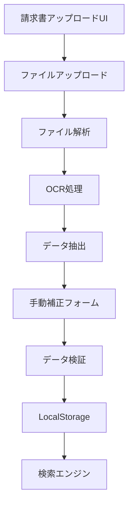

# 請求書読み込み機能 - アーキテクチャ設計書

## 📋 要件定義

### 機能要件
1. **ファイル読み込み**
   - PDF/画像(JPEG/PNG)両方対応
   - ドラッグ&ドロップアップロード
   - ファイルプレビュー機能

2. **データ抽出**
   - OCR(光学文字認識)による自動抽出
   - 手動補正UI提供
   - 抽出結果の確認・編集

3. **データ管理**
   - LocalStorageベースのストレージ拡張
   - ファイルはBase64でエンコード保存
   - 既存Invoiceモデルに統合

4. **検索機能**
   - 請求書番号検索
   - 顧客名検索
   - 金額範囲検索
   - 日付範囲検索
   - 複合条件検索

## 🏗️ システムアーキテクチャ



## 🔧 技術選定

### 1. OCRライブラリ

#### 選択肢の比較

| ライブラリ | メリット | デメリット | 推奨度 |
|-----------|---------|----------|--------|
| **Tesseract.js** | ✅ 完全フロントエンド<br>✅ 日本語対応<br>✅ 無料 | ⚠️ 精度は中程度<br>⚠️ 処理時間やや長い | ⭐⭐⭐⭐ |
| **Google Cloud Vision API** | ✅ 高精度<br>✅ 優れた日本語認識 | ❌ 有料<br>❌ API依存 | ⭐⭐⭐ |
| **AWS Textract** | ✅ 高精度<br>✅ フォーム認識 | ❌ 有料<br>❌ AWS依存 | ⭐⭐⭐ |

**採用: Tesseract.js**

**理由:**
- フロントエンドで完結(サーバー不要)
- 無料で利用可能
- 日本語対応済み
- LocalStorageベースと相性良好

### 2. PDFパーシング

**採用: pdf.js (既存の pdf-lib と組み合わせ)**

- Mozilla製の信頼性の高いライブラリ
- テキスト抽出・レンダリング対応
- すでにプロジェクトに類似ライブラリあり

### 3. 画像処理

**採用: Canvas API (ネイティブブラウザAPI)**

- 追加ライブラリ不要
- 画像リサイズ・最適化
- OCR前処理に利用

## 📊 データモデル設計

### 拡張Invoice型

```typescript
// 既存のInvoice型を拡張
export interface Invoice {
  id: string
  invoiceNumber: string
  client: Client
  issueDate: Date
  dueDate: Date
  lineItems: InvoiceLineItem[]
  subtotal: number
  tax: number
  taxRate: number
  total: number
  status: InvoiceStatus
  paidDate?: Date
  notes?: string
  createdAt: Date
  updatedAt: Date
  
  // 🆕 新規追加フィールド
  source?: InvoiceSource          // データソース
  attachments?: InvoiceAttachment[] // 添付ファイル
  ocrData?: OCRResult              // OCR結果メタデータ
}

// データソース
export type InvoiceSource = 
  | "manual"      // 手動作成
  | "pdf_import"  // PDFインポート
  | "image_import" // 画像インポート

// 添付ファイル
export interface InvoiceAttachment {
  id: string
  fileName: string
  fileType: string  // "application/pdf" | "image/jpeg" | "image/png"
  fileSize: number  // bytes
  base64Data: string // Base64エンコードされたファイルデータ
  uploadedAt: Date
}

// OCR結果
export interface OCRResult {
  confidence: number  // 0-1の信頼度
  processingTime: number // ms
  extractedFields: {
    invoiceNumber?: { value: string; confidence: number }
    clientName?: { value: string; confidence: number }
    issueDate?: { value: string; confidence: number }
    total?: { value: number; confidence: number }
    // ... その他フィールド
  }
}
```

### 検索インデックス設計

```typescript
export interface SearchIndex {
  invoiceId: string
  searchableText: string // 全フィールド結合
  keywords: string[]     // キーワード配列
  numericFields: {
    total: number
    issueDate: number    // timestamp
    dueDate: number      // timestamp
  }
}
```

## 🎨 UIコンポーネント設計

### 1. InvoiceUploadComponent

```typescript
<InvoiceUpload>
  <DropZone>
    {/* ドラッグ&ドロップエリア */}
  </DropZone>
  <FilePreview>
    {/* アップロードファイルプレビュー */}
  </FilePreview>
  <ProcessingStatus>
    {/* OCR処理状況表示 */}
  </ProcessingStatus>
</InvoiceUpload>
```

### 2. OCRResultEditor

```typescript
<OCRResultEditor>
  <ConfidenceIndicator />
  <ExtractedDataForm>
    {/* 抽出データの編集フォーム */}
    <Field name="invoiceNumber" confidence={0.95} />
    <Field name="clientName" confidence={0.87} />
    {/* ... */}
  </ExtractedDataForm>
  <ActionButtons>
    <Button>承認</Button>
    <Button>再抽出</Button>
  </ActionButtons>
</OCRResultEditor>
```

### 3. AdvancedSearch

```typescript
<AdvancedSearch>
  <SearchFilters>
    <TextInput name="invoiceNumber" />
    <TextInput name="clientName" />
    <NumberRange name="amount" />
    <DateRange name="issueDate" />
    <SourceFilter />
  </SearchFilters>
  <SearchResults>
    {/* 検索結果リスト */}
  </SearchResults>
</AdvancedSearch>
```

## 🔄 処理フロー

### インポートフロー

```
1. ファイル選択/ドロップ
   ↓
2. ファイル検証
   - 形式チェック (PDF/JPEG/PNG)
   - サイズチェック (< 10MB推奨)
   ↓
3. ファイルプレビュー表示
   ↓
4. OCR処理開始
   - PDFの場合: pdf.jsでページ画像化 → OCR
   - 画像の場合: 直接OCR
   ↓
5. データ抽出
   - テキスト認識
   - フィールドパーシング
   - 信頼度計算
   ↓
6. 手動補正UI表示
   - 抽出結果プレビュー
   - 低信頼度フィールドをハイライト
   - ユーザー編集
   ↓
7. データ検証
   - 必須フィールドチェック
   - フォーマット検証
   ↓
8. 保存
   - Invoiceとして保存
   - 添付ファイルをBase64で保存
   - 検索インデックス更新
```

### 検索フロー

```
1. 検索条件入力
   ↓
2. クエリ構築
   - テキスト検索: 部分一致
   - 数値検索: 範囲指定
   - 日付検索: 期間指定
   ↓
3. LocalStorageから検索
   - フィルタリング
   - ソート
   ↓
4. 結果表示
   - ページネーション
   - ハイライト表示
```

## 💾 ストレージ戦略

### LocalStorage構造

```typescript
// 既存
localStorage.setItem("invoices", JSON.stringify(invoices))

// 新規追加
localStorage.setItem("invoice_attachments", JSON.stringify(attachments))
localStorage.setItem("search_index", JSON.stringify(searchIndex))
```

### 容量管理

- **LocalStorage制限**: 通常5-10MB
- **対策**:
  1. 画像を最大1MB以下に圧縮
  2. 古い添付ファイルの削除機能
  3. 容量警告UI

### Base64エンコード戦略

```typescript
// ファイル → Base64
function fileToBase64(file: File): Promise<string> {
  return new Promise((resolve, reject) => {
    const reader = new FileReader()
    reader.onload = () => resolve(reader.result as string)
    reader.onerror = reject
    reader.readAsDataURL(file)
  })
}

// Base64 → Blob (ダウンロード用)
function base64ToBlob(base64: string, mimeType: string): Blob {
  const byteString = atob(base64.split(',')[1])
  const ab = new ArrayBuffer(byteString.length)
  const ia = new Uint8Array(ab)
  for (let i = 0; i < byteString.length; i++) {
    ia[i] = byteString.charCodeAt(i)
  }
  return new Blob([ab], { type: mimeType })
}
```

## 🔍 検索アルゴリズム

### シンプル全文検索実装

```typescript
function searchInvoices(
  invoices: Invoice[],
  filters: SearchFilters
): Invoice[] {
  return invoices.filter(invoice => {
    // テキスト検索
    if (filters.keyword) {
      const searchText = [
        invoice.invoiceNumber,
        invoice.client.name,
        invoice.client.email,
        invoice.notes,
      ].join(' ').toLowerCase()
      
      if (!searchText.includes(filters.keyword.toLowerCase())) {
        return false
      }
    }
    
    // 金額範囲
    if (filters.minAmount && invoice.total < filters.minAmount) {
      return false
    }
    if (filters.maxAmount && invoice.total > filters.maxAmount) {
      return false
    }
    
    // 日付範囲
    if (filters.startDate && invoice.issueDate < filters.startDate) {
      return false
    }
    if (filters.endDate && invoice.issueDate > filters.endDate) {
      return false
    }
    
    // ステータス
    if (filters.status && !filters.status.includes(invoice.status)) {
      return false
    }
    
    // ソース
    if (filters.source && invoice.source !== filters.source) {
      return false
    }
    
    return true
  })
}
```

## 📦 必要パッケージ

```json
{
  "dependencies": {
    "tesseract.js": "^5.0.0",      // OCR
    "pdfjs-dist": "^4.0.0",        // PDF解析
    "react-dropzone": "^14.2.0"    // ファイルアップロード
  }
}
```

## 🎯 実装計画

### Phase 1: 基盤構築
1. データモデル拡張
2. ストレージ機能拡張
3. ファイルアップロードUI

### Phase 2: OCR統合
1. Tesseract.js導入
2. PDF/画像解析処理
3. データ抽出ロジック

### Phase 3: UI実装
1. インポート画面
2. 手動補正フォーム
3. プレビュー機能

### Phase 4: 検索機能
1. 高度な検索UI
2. フィルタリングロジック
3. 結果表示

### Phase 5: 最適化
1. パフォーマンス改善
2. エラーハンドリング
3. テスト・デバッグ

## ⚠️ 技術的課題と対策

### 1. OCR精度の問題
**課題**: 日本語OCRは精度が不安定
**対策**: 
- 信頼度スコア表示
- 手動補正UI必須化
- プレビュー機能で視覚確認

### 2. LocalStorage容量制限
**課題**: 5-10MBの制限
**対策**:
- 画像圧縮(最大1MB)
- 古いファイル削除機能
- 容量モニタリング

### 3. OCR処理時間
**課題**: 大きなPDFで処理に時間がかかる
**対策**:
- プログレスバー表示
- Web Worker使用
- ページ単位処理

### 4. ブラウザ互換性
**課題**: 古いブラウザでの動作
**対策**:
- ポリフィル導入
- フォールバックUI
- 推奨環境の明示

## 📊 パフォーマンス目標

- ファイルアップロード: < 1秒
- OCR処理(1ページ): < 5秒
- 検索応答時間: < 100ms
- UI応答性: 60 FPS

## 🔐 セキュリティ考慮事項

1. **ファイルサイズ制限**: 10MB
2. **MIME Typeチェック**: PDF/画像のみ
3. **XSS対策**: Base64データのサニタイズ
4. **個人情報保護**: LocalStorageの暗号化検討

---

**作成日**: 2025-11-12  
**最終更新**: 2025-11-12  
**バージョン**: 1.0.0  
**ステータス**: 設計完了・実装待ち