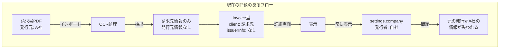
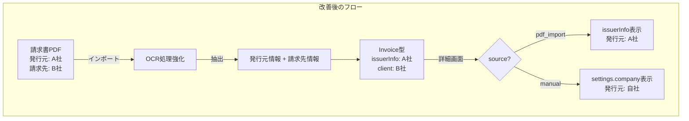
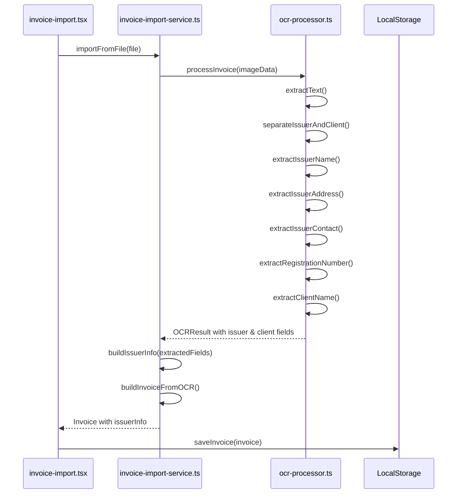
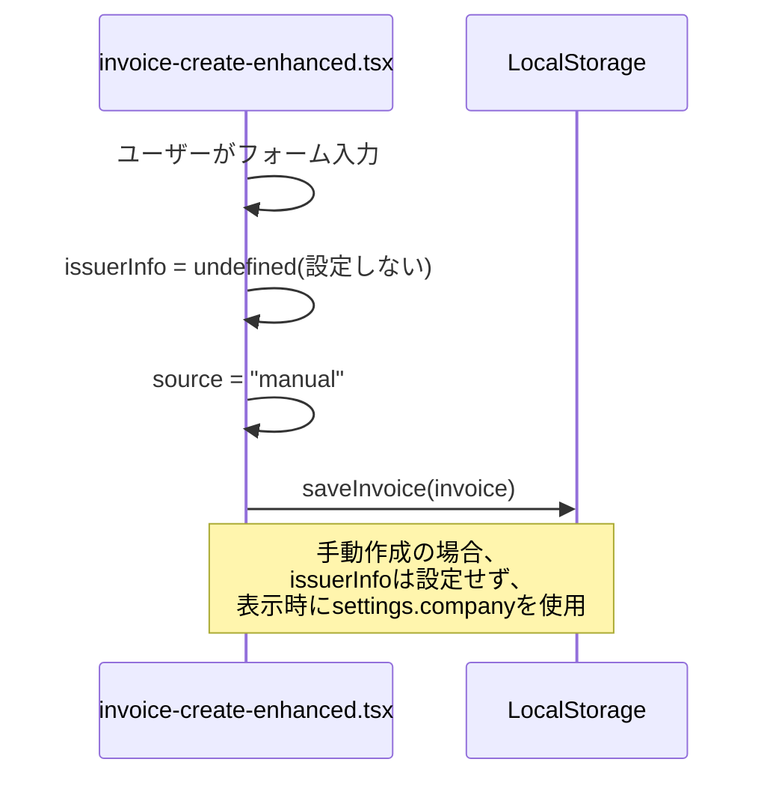
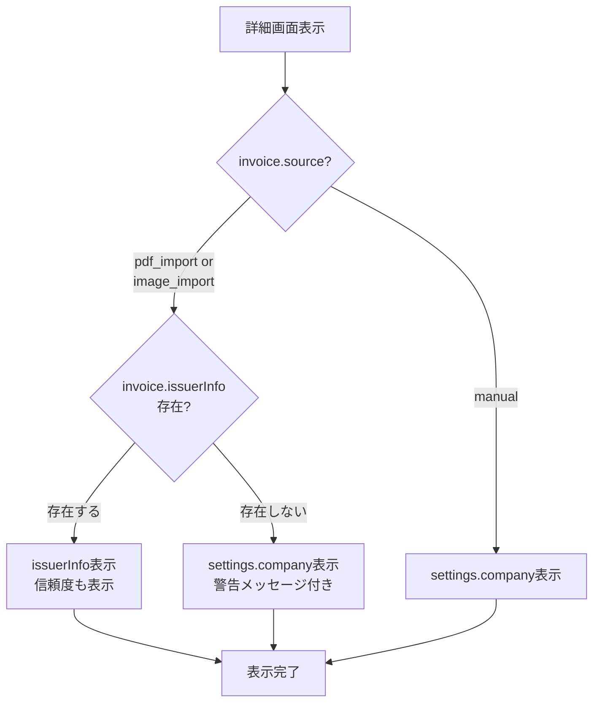

# 請求書発行元情報管理アーキテクチャ設計書

## 📋 概要

請求書管理システムにおける「発行元情報」の適切な管理と表示に関する包括的なアーキテクチャ設計

**ステータス**: 設計完了・実装待ち  
**作成日**: 2025-11-16  
**バージョン**: 1.0.0

---

## 🎯 解決すべき問題

### 根本原因の分析

**問題1: 発行元情報の混在**
- システムが「請求書 = 自社が発行するもの」という前提で設計されている
- インポートされたPDFの発行元情報(実際の請求書を発行した企業)が保存・表示されていない
- 詳細画面の「発行者」セクション([`components/invoice-detail-enhanced.tsx:180-186`](components/invoice-detail-enhanced.tsx:180))が常に`settings.company`を表示

**問題2: データモデルの不足**
- [`Invoice`](lib/types.ts:31)型に`issuerInfo`(発行元情報)フィールドが存在しない
- OCRが発行元情報を抽出していない
- 「請求先」と「発行元」を区別する仕組みがない

**問題3: UI/UXの問題**
- インポートデータでも自社情報が「発行者」として表示される
- 実際の発行元企業の情報が失われる
- ユーザーが混乱する

### 現在のデータフロー



---

## ✅ 設計方針

### 基本原則

1. **データソースによる分岐**: インポートデータと手動作成データで発行元情報の扱いを分ける
2. **発行元情報の保存**: インポートデータの発行元情報をOCRで抽出し、保存する
3. **表示ロジックの明確化**: 詳細画面で適切な発行元情報を表示する
4. **後方互換性の維持**: 既存データに影響を与えない設計

### データフロー設計



---

## 🏗️ データモデル設計

### 1. IssuerInfo インターフェース

**新規追加**: [`lib/types.ts`](lib/types.ts:1)

```typescript
/**
 * 発行元情報
 * インポートされた請求書の発行元企業情報
 */
export interface IssuerInfo {
  // 基本情報
  name: string                    // 企業名・個人名
  address?: string                // 住所
  postalCode?: string             // 郵便番号
  phone?: string                  // 電話番号
  email?: string                  // メールアドレス
  
  // インボイス制度対応
  registrationNumber?: string     // 適格請求書発行事業者登録番号(Tから始まる13桁)
  
  // 任意情報
  contactPerson?: string          // 担当者名
  department?: string             // 部署名
  website?: string                // ウェブサイト
  fax?: string                    // FAX番号
  
  // 信頼度(OCR抽出時)
  confidence?: number             // 0-1の信頼度
}
```

### 2. Invoice型の拡張

**変更箇所**: [`lib/types.ts:31`](lib/types.ts:31)

```typescript
export interface Invoice {
  // ... 既存のフィールド
  
  // 🆕 発行元情報(インポートデータの場合に設定)
  issuerInfo?: IssuerInfo
  
  // 既存フィールド(参考)
  client: Client                    // 請求先情報
  source?: InvoiceSource            // データソース
  isReadonly?: boolean              // 読み取り専用フラグ
  originalPdfAttachmentId?: string  // 元のPDFのID
}
```

### 3. OCRResult型の拡張

**変更箇所**: [`lib/types.ts:66`](lib/types.ts:66)

```typescript
export interface OCRResult {
  confidence: number
  processingTime: number
  extractedFields: {
    // ... 既存のフィールド
    
    // 🆕 発行元情報フィールド
    issuerName?: FieldExtraction
    issuerAddress?: FieldExtraction
    issuerPostalCode?: FieldExtraction
    issuerPhone?: FieldExtraction
    issuerEmail?: FieldExtraction
    issuerRegistrationNumber?: FieldExtraction  // インボイス登録番号
    
    // 既存の請求先情報
    clientName?: FieldExtraction
    // ...
  }
}
```

### 4. データの互換性戦略

**既存データへの影響**:
- `issuerInfo`はオプショナルフィールドのため、既存データとの互換性を維持
- 既存のインポートデータは`issuerInfo`が`undefined`となり、フォールバック表示される
- 手動作成データは従来通り`settings.company`を使用

---

## 🔍 OCR処理の設計

### 1. 発行元情報抽出パターン

**実装箇所**: [`lib/ocr-processor.ts:139`](lib/ocr-processor.ts:139)の`parseInvoiceFields`メソッド

#### 1.1 企業名の抽出

```typescript
/**
 * 発行元企業名の抽出
 * 
 * 戦略:
 * 1. ドキュメント上部(最初の20行)から企業名を探す
 * 2. 「株式会社」「合同会社」「有限会社」などのキーワードを検出
 * 3. 大きなフォントサイズ(OCRでは判別困難なため位置で判断)
 * 4. 請求先情報の前に記載されている
 */
private extractIssuerName(text: string, lines: string[]): FieldExtraction | undefined {
  // パターン1: 「株式会社」「合同会社」などを含む行(最初の20行から)
  const companyPatterns = [
    /^([株合有]式会社|合同会社|有限会社|一般社団法人|公益社団法人|特定非営利活動法人|[^\\n]{2,30}株式会社)/,
    /^([^\\n]{2,30}(?:株式会社|合同会社|有限会社|Co\\.?|Ltd\\.?|Inc\\.?))/i,
  ]
  
  const topLines = lines.slice(0, 20)
  
  for (const line of topLines) {
    // 「宛」「様」「御中」を含む行は請求先なのでスキップ
    if (/[宛様御中]/.test(line)) continue
    
    for (const pattern of companyPatterns) {
      const match = line.match(pattern)
      if (match) {
        const companyName = match[1].trim()
        // 妥当性チェック(3-50文字)
        if (companyName.length >= 3 && companyName.length <= 50) {
          return {
            value: companyName,
            confidence: 0.85,
          }
        }
      }
    }
  }
  
  // パターン2: 「請求書」の直前の行を企業名と推定
  const invoiceHeaderIndex = lines.findIndex(line => /^請求書$/.test(line.trim()))
  if (invoiceHeaderIndex > 0) {
    const candidateLine = lines[invoiceHeaderIndex - 1].trim()
    if (candidateLine.length >= 3 && candidateLine.length <= 50) {
      return {
        value: candidateLine,
        confidence: 0.7,
      }
    }
  }
  
  return undefined
}
```

#### 1.2 住所・郵便番号の抽出

```typescript
/**
 * 発行元住所の抽出
 * 
 * 戦略:
 * 1. 郵便番号パターン(〒xxx-xxxx)を検出
 * 2. その直後の行を住所として抽出
 * 3. 都道府県名から始まる行を検出
 */
private extractIssuerAddress(text: string, lines: string[]): {
  address?: FieldExtraction
  postalCode?: FieldExtraction
} {
  const result: {
    address?: FieldExtraction
    postalCode?: FieldExtraction
  } = {}
  
  // 郵便番号パターン
  const postalCodePattern = /〒\s*(\d{3}[-−ー]\d{4})/
  const postalMatch = text.match(postalCodePattern)
  
  if (postalMatch) {
    result.postalCode = {
      value: postalMatch[1].replace(/[−ー]/g, '-'),
      confidence: 0.9,
    }
    
    // 郵便番号の次の行を住所と推定
    const postalLineIndex = lines.findIndex(line => postalCodePattern.test(line))
    if (postalLineIndex !== -1 && postalLineIndex + 1 < lines.length) {
      const addressLine = lines[postalLineIndex + 1].trim()
      if (addressLine.length >= 5 && addressLine.length <= 100) {
        result.address = {
          value: addressLine,
          confidence: 0.85,
        }
      }
    }
  } else {
    // 郵便番号がない場合、都道府県名から始まる行を探す
    const prefectures = ['北海道', '青森県', '岩手県', '宮城県', '秋田県', '山形県', '福島県',
                        '茨城県', '栃木県', '群馬県', '埼玉県', '千葉県', '東京都', '神奈川県',
                        '新潟県', '富山県', '石川県', '福井県', '山梨県', '長野県', '岐阜県',
                        '静岡県', '愛知県', '三重県', '滋賀県', '京都府', '大阪府', '兵庫県',
                        '奈良県', '和歌山県', '鳥取県', '島根県', '岡山県', '広島県', '山口県',
                        '徳島県', '香川県', '愛媛県', '高知県', '福岡県', '佐賀県', '長崎県',
                        '熊本県', '大分県', '宮崎県', '鹿児島県', '沖縄県']
    
    for (const line of lines.slice(0, 30)) {
      // 「宛」「様」を含む行はスキップ
      if (/[宛様御中]/.test(line)) continue
      
      for (const prefecture of prefectures) {
        if (line.startsWith(prefecture)) {
          result.address = {
            value: line.trim(),
            confidence: 0.75,
          }
          break
        }
      }
      if (result.address) break
    }
  }
  
  return result
}
```

#### 1.3 電話番号・メールアドレスの抽出

```typescript
/**
 * 発行元の電話番号・メールアドレス抽出
 */
private extractIssuerContact(text: string): {
  phone?: FieldExtraction
  email?: FieldExtraction
} {
  const result: {
    phone?: FieldExtraction
    email?: FieldExtraction
  } = {}
  
  // 電話番号パターン
  const phonePatterns = [
    /(?:TEL|Tel|電話)[:\s]*(\d{2,4}[-−]\d{2,4}[-−]\d{4})/,
    /(\d{2,4}[-−]\d{2,4}[-−]\d{4})/,
  ]
  
  for (const pattern of phonePatterns) {
    const match = text.match(pattern)
    if (match) {
      result.phone = {
        value: match[1].replace(/[−]/g, '-'),
        confidence: 0.85,
      }
      break
    }
  }
  
  // メールアドレスパターン
  const emailPattern = /([a-zA-Z0-9._%+-]+@[a-zA-Z0-9.-]+\.[a-zA-Z]{2,})/
  const emailMatch = text.match(emailPattern)
  if (emailMatch) {
    result.email = {
      value: emailMatch[1],
      confidence: 0.9,
    }
  }
  
  return result
}
```

#### 1.4 インボイス登録番号の抽出

```typescript
/**
 * 適格請求書発行事業者登録番号の抽出
 * 
 * フォーマット: T + 13桁の数字(Tから始まる13桁)
 * 例: T1234567890123
 */
private extractRegistrationNumber(text: string): FieldExtraction | undefined {
  // パターン1: 「登録番号」「登録No」などのラベル付き
  const labeledPattern = /(?:登録番号|登録No|Registration|Reg\.?\s*No\.?)[:\s]*(T\d{13})/i
  const labeledMatch = text.match(labeledPattern)
  
  if (labeledMatch) {
    return {
      value: labeledMatch[1],
      confidence: 0.95,
    }
  }
  
  // パターン2: ラベルなしでT + 13桁を検出
  const unlabeledPattern = /\b(T\d{13})\b/
  const unlabeledMatch = text.match(unlabeledPattern)
  
  if (unlabeledMatch) {
    return {
      value: unlabeledMatch[1],
      confidence: 0.8,
    }
  }
  
  return undefined
}
```

### 2. 発行元と請求先の区別ロジック

**重要な考慮事項**:
- 請求書PDFには「発行元」(上部)と「請求先」(「様」「御中」「宛」付き)の両方が記載されている
- OCRで両者を区別する必要がある

**区別戦略**:

```typescript
/**
 * 発行元情報と請求先情報の区別
 * 
 * ルール:
 * 1. 発行元は通常、ドキュメント上部(最初の30行)に記載
 * 2. 請求先は「様」「御中」「宛」などのキーワード付き
 * 3. 発行元の方が先に出現する
 */
private separateIssuerAndClient(text: string, lines: string[]): {
  issuerSection: string[]
  clientSection: string[]
} {
  // 「様」「御中」「宛」が出現する行を検出
  const clientIndicatorIndex = lines.findIndex(line => 
    /[様御中宛]/.test(line) && !/^(?:TEL|Tel|FAX|Fax|担当|〒)/.test(line)
  )
  
  if (clientIndicatorIndex !== -1) {
    // 請求先マーカーより前を発行元セクション
    const issuerSection = lines.slice(0, clientIndicatorIndex)
    // 請求先マーカー周辺を請求先セクション
    const clientSection = lines.slice(
      Math.max(0, clientIndicatorIndex - 2),
      Math.min(lines.length, clientIndicatorIndex + 5)
    )
    
    return { issuerSection, clientSection }
  }
  
  // マーカーがない場合、最初の30行を発行元、以降を請求先と仮定
  return {
    issuerSection: lines.slice(0, 30),
    clientSection: lines.slice(30),
  }
}
```

### 3. 信頼度スコアの算出

```typescript
/**
 * 発行元情報全体の信頼度を算出
 * 
 * 考慮要素:
 * - 企業名の有無(必須)
 * - 住所の有無
 * - 電話番号の有無
 * - 登録番号の有無
 */
private calculateIssuerConfidence(issuerInfo: IssuerInfo): number {
  let score = 0
  let maxScore = 0
  
  // 企業名(必須、配点: 40%)
  if (issuerInfo.name) {
    score += 0.4 * (issuerInfo.confidence || 0.8)
  }
  maxScore += 0.4
  
  // 住所(配点: 25%)
  if (issuerInfo.address) {
    score += 0.25
  }
  maxScore += 0.25
  
  // 電話番号(配点: 15%)
  if (issuerInfo.phone) {
    score += 0.15
  }
  maxScore += 0.15
  
  // 登録番号(配点: 20%)
  if (issuerInfo.registrationNumber) {
    score += 0.20
  }
  maxScore += 0.20
  
  return maxScore > 0 ? score / maxScore : 0
}
```

### 4. エッジケースの処理

#### ケース1: 複数の企業名が含まれる場合

```typescript
/**
 * 複数の企業名候補がある場合の処理
 * 
 * 優先順位:
 * 1. 最も上部に記載されているもの
 * 2. 最も長い企業名(詳細な正式名称の可能性が高い)
 * 3. 「株式会社」などの法人格を含むもの
 */
private selectBestIssuerName(candidates: FieldExtraction[]): FieldExtraction {
  if (candidates.length === 1) return candidates[0]
  
  // 信頼度でソート
  return candidates.sort((a, b) => {
    // まず信頼度で比較
    if (b.confidence !== a.confidence) {
      return b.confidence - a.confidence
    }
    // 同じ信頼度なら文字数で比較(長い方を優先)
    return b.value.length - a.value.length
  })[0]
}
```

#### ケース2: 発行元情報が抽出できない場合

```typescript
/**
 * 発行元情報が抽出できない場合のフォールバック
 * 
 * 対応:
 * 1. issuerInfoをundefinedに設定
 * 2. UI側でsettings.companyを表示(警告メッセージ付き)
 */
```

---

## 🔄 データフロー設計

### 1. インポート時の処理フロー



### 2. 手動作成時の処理フロー



### 3. 詳細画面での表示ロジック



---

## 💻 実装設計

### Phase 1: データモデルの更新

#### 1.1 IssuerInfo型の追加

**ファイル**: [`lib/types.ts`](lib/types.ts:1)

```typescript
// PaymentInfo の後に追加
export interface IssuerInfo {
  name: string
  address?: string
  postalCode?: string
  phone?: string
  email?: string
  registrationNumber?: string
  contactPerson?: string
  department?: string
  website?: string
  fax?: string
  confidence?: number
}
```

#### 1.2 Invoice型の拡張

**ファイル**: [`lib/types.ts:31`](lib/types.ts:31)

```typescript
export interface Invoice {
  // ... 既存フィールド
  issuerInfo?: IssuerInfo  // 🆕 追加
}
```

#### 1.3 OCRResult型の拡張

**ファイル**: [`lib/types.ts:66`](lib/types.ts:66)

```typescript
export interface OCRResult {
  confidence: number
  processingTime: number
  extractedFields: {
    // 🆕 発行元情報フィールド
    issuerName?: FieldExtraction
    issuerAddress?: FieldExtraction
    issuerPostalCode?: FieldExtraction
    issuerPhone?: FieldExtraction
    issuerEmail?: FieldExtraction
    issuerRegistrationNumber?: FieldExtraction
    
    // 既存の請求先情報
    clientName?: FieldExtraction
    // ... その他既存フィールド
  }
}
```

### Phase 2: OCR処理の実装

#### 2.1 発行元情報抽出メソッドの追加

**ファイル**: [`lib/ocr-processor.ts:139`](lib/ocr-processor.ts:139)

[`parseInvoiceFields`](lib/ocr-processor.ts:139)メソッドに以下を追加:

```typescript
private parseInvoiceFields(text: string): OCRResult["extractedFields"] {
  // ... 既存のコード
  
  // 🆕 発行元と請求先を分離
  const { issuerSection, clientSection } = this.separateIssuerAndClient(text, lines)
  
  // 🆕 発行元情報の抽出
  const issuerName = this.extractIssuerName(text, issuerSection)
  if (issuerName) {
    fields.issuerName = issuerName
  }
  
  const issuerAddressInfo = this.extractIssuerAddress(text, issuerSection)
  if (issuerAddressInfo.address) {
    fields.issuerAddress = issuerAddressInfo.address
  }
  if (issuerAddressInfo.postalCode) {
    fields.issuerPostalCode = issuerAddressInfo.postalCode
  }
  
  const issuerContact = this.extractIssuerContact(issuerSection.join('\n'))
  if (issuerContact.phone) {
    fields.issuerPhone = issuerContact.phone
  }
  if (issuerContact.email) {
    fields.issuerEmail = issuerContact.email
  }
  
  const registrationNumber = this.extractRegistrationNumber(text)
  if (registrationNumber) {
    fields.issuerRegistrationNumber = registrationNumber
  }
  
  // 🆕 既存の顧客名抽出を clientSection から行うように変更
  const clientPattern = /([^\n]+?)(?:様|御中|宛)/
  const clientMatch = clientSection.join('\n').match(clientPattern)
  if (clientMatch) {
    fields.clientName = {
      value: clientMatch[1].trim(),
      confidence: 0.8,
    }
  }
  
  // ... 既存のコード
}
```

#### 2.2 ヘルパーメソッドの実装

**ファイル**: [`lib/ocr-processor.ts`](lib/ocr-processor.ts:1)

上記のセクション「OCR処理の設計」で定義したメソッドを実装:
- `separateIssuerAndClient()`
- `extractIssuerName()`
- `extractIssuerAddress()`
- `extractIssuerContact()`
- `extractRegistrationNumber()`
- `calculateIssuerConfidence()`
- `selectBestIssuerName()`

### Phase 3: インポートサービスの更新

#### 3.1 buildInvoiceFromOCRの更新

**ファイル**: [`lib/invoice-import-service.ts:65`](lib/invoice-import-service.ts:65)

```typescript
private buildInvoiceFromOCR(
  ocrData: OCRResult,
  existingClients: Client[],
  fileType: string
): Partial<Invoice> {
  const { extractedFields } = ocrData
  
  // ... 既存のコード(client構築など)
  
  // 🆕 発行元情報の構築
  const issuerInfo = this.buildIssuerInfo(extractedFields)
  
  return {
    // ... 既存のフィールド
    issuerInfo,  // 🆕 追加
  }
}
```

#### 3.2 buildIssuerInfoメソッドの実装

**ファイル**: [`lib/invoice-import-service.ts`](lib/invoice-import-service.ts:1)

```typescript
/**
 * OCR結果から発行元情報を構築
 */
private buildIssuerInfo(
  extractedFields: OCRResult["extractedFields"]
): IssuerInfo | undefined {
  // 企業名が抽出されていない場合はundefined
  if (!extractedFields.issuerName) {
    return undefined
  }
  
  const issuerInfo: IssuerInfo = {
    name: extractedFields.issuerName.value,
    address: extractedFields.issuerAddress?.value,
    postalCode: extractedFields.issuerPostalCode?.value,
    phone: extractedFields.issuerPhone?.value,
    email: extractedFields.issuerEmail?.value,
    registrationNumber: extractedFields.issuerRegistrationNumber?.value,
  }
  
  // 信頼度を計算
  issuerInfo.confidence = this.calculateIssuerConfidence(issuerInfo)
  
  // 信頼度が低すぎる場合(< 0.3)はundefinedを返す
  if (issuerInfo.confidence < 0.3) {
    console.warn('発行元情報の信頼度が低いため破棄します:', issuerInfo)
    return undefined
  }
  
  return issuerInfo
}

/**
 * 発行元情報の信頼度を算出
 */
private calculateIssuerConfidence(issuerInfo: IssuerInfo): number {
  let score = 0
  let maxScore = 0
  
  // 企業名(必須、配点: 40%)
  if (issuerInfo.name) {
    score += 0.4
  }
  maxScore += 0.4
  
  // 住所(配点: 25%)
  if (issuerInfo.address) {
    score += 0.25
  }
  maxScore += 0.25
  
  // 電話番号(配点: 15%)
  if (issuerInfo.phone) {
    score += 0.15
  }
  maxScore += 0.15
  
  // 登録番号(配点: 20%)
  if (issuerInfo.registrationNumber) {
    score += 0.20
  }
  maxScore += 0.20
  
  return maxScore > 0 ? score / maxScore : 0
}
```

### Phase 4: UI実装

#### 4.1 詳細画面の発行者セクション更新

**ファイル**: [`components/invoice-detail-enhanced.tsx:178-186`](components/invoice-detail-enhanced.tsx:178)

**Before:**
```tsx
<div>
  <p className="text-sm text-muted-foreground mb-2">発行者</p>
  <div>
    <p className="font-semibold text-foreground">{settings.company.name}</p>
    <p className="text-sm text-muted-foreground">{settings.company.address}</p>
    <p className="text-sm text-muted-foreground">{settings.company.email}</p>
  </div>
</div>
```

**After:**
```tsx
<div>
  <p className="text-sm text-muted-foreground mb-2">発行者</p>
  
  {/* インポートデータで発行元情報がある場合 */}
  {(invoice.source === "pdf_import" || invoice.source === "image_import") && invoice.issuerInfo ? (
    <div>
      <div className="bg-blue-50 p-2 rounded mb-2">
        <p className="text-xs text-blue-800">
          ※ インポートされた請求書の発行元
          {invoice.issuerInfo.confidence && (
            <span className="ml-2">
              (信頼度: {(invoice.issuerInfo.confidence * 100).toFixed(0)}%)
            </span>
          )}
        </p>
      </div>
      <p className="font-semibold text-foreground">{invoice.issuerInfo.name}</p>
      {invoice.issuerInfo.registrationNumber && (
        <p className="text-xs text-muted-foreground mt-1">
          登録番号: {invoice.issuerInfo.registrationNumber}
        </p>
      )}
      {invoice.issuerInfo.postalCode && (
        <p className="text-sm text-muted-foreground">
          〒{invoice.issuerInfo.postalCode}
        </p>
      )}
      {invoice.issuerInfo.address && (
        <p className="text-sm text-muted-foreground">{invoice.issuerInfo.address}</p>
      )}
      {invoice.issuerInfo.phone && (
        <p className="text-sm text-muted-foreground">TEL: {invoice.issuerInfo.phone}</p>
      )}
      {invoice.issuerInfo.email && (
        <p className="text-sm text-muted-foreground">{invoice.issuerInfo.email}</p>
      )}
    </div>
  ) : (invoice.source === "pdf_import" || invoice.source === "image_import") ? (
    /* インポートデータだが発行元情報が抽出できなかった場合 */
    <div>
      <div className="bg-yellow-50 p-2 rounded mb-2">
        <p className="text-xs text-yellow-800">
          ⚠️ 発行元情報を抽出できませんでした
        </p>
      </div>
      <p className="font-semibold text-foreground">{settings.company.name}</p>
      <p className="text-sm text-muted-foreground">{settings.company.address}</p>
      <p className="text-sm text-muted-foreground">{settings.company.email}</p>
    </div>
  ) : (
    /* 手動作成データの場合 */
    <div>
      <p className="font-semibold text-foreground">{settings.company.name}</p>
      <p className="text-sm text-muted-foreground">{settings.company.address}</p>
      <p className="text-sm text-muted-foreground">{settings.company.email}</p>
    </div>
  )}
</div>
```

#### 4.2 編集画面での発行元情報の扱い

**ファイル**: [`components/invoice-create-enhanced.tsx`](components/invoice-create-enhanced.tsx:1)

**方針**:
- インポートデータ(`isReadonly: true`)の場合、編集画面は表示しない
- 既存の仕様通り、編集ボタン自体を非表示にする([`invoice-detail-enhanced.tsx:294-300`](components/invoice-detail-enhanced.tsx:294)で実装済み)

#### 4.3 バリデーション要件

**インポート時のバリデーション**:

```typescript
// invoice-import.tsx での確認画面
const validateIssuerInfo = (issuerInfo?: IssuerInfo): boolean => {
  if (!issuerInfo) return true  // オプショナルなのでOK
  
  // 企業名は必須
  if (!issuerInfo.name || issuerInfo.name.length < 2) {
    return false
  }
  
  // 登録番号の形式チェック(ある場合)
  if (issuerInfo.registrationNumber) {
    const regNumberPattern = /^T\d{13}$/
    if (!regNumberPattern.test(issuerInfo.registrationNumber)) {
      console.warn('不正な登録番号形式:', issuerInfo.registrationNumber)
      // 警告のみで処理は続行
    }
  }
  
  return true
}
```

---

## 📋 マイグレーション戦略

### 既存データへの影響

**影響なし**:
- `issuerInfo`はオプショナルフィールド
- 既存のインポートデータは`issuerInfo: undefined`として扱われる
- UI側でフォールバック表示(警告メッセージ付き)

### バージョニング戦略

**データ構造バージョン**: v1.1
- v1.0: `issuerInfo`なし
- v1.1: `issuerInfo`追加(オプショナル)

**互換性**:
- 新しいコードは古いデータを読める(undefined として扱う)
- 古いコードも新しいデータを読める(issuerInfo を無視)

### ロールバックプラン

**万が一問題が発生した場合**:

1. OCR処理の無効化:
   ```typescript
   // ocr-processor.ts
   // 発行元情報抽出をコメントアウト
   // fields.issuerName = ...
   ```

2. UI表示のフォールバック:
   ```tsx
   // 常に settings.company を表示
   {settings.company.name}
   ```

3. データクリーンアップ(必要に応じて):
   ```typescript
   // すべての請求書から issuerInfo を削除
   invoices.forEach(inv => delete inv.issuerInfo)
   ```

---

## 🧪 テスト戦略

### 単体テスト

#### OCR処理のテスト

```typescript
describe('OCRProcessor - 発行元情報抽出', () => {
  test('企業名を正しく抽出できる', () => {
    const text = `
株式会社テスト商事
〒100-0001
東京都千代田区千代田1-1-1
TEL: 03-1234-5678

御請求書

株式会社サンプル 様
    `
    const result = ocrProcessor.parseInvoiceFields(text)
    expect(result.issuerName?.value).toBe('株式会社テスト商事')
  })
  
  test('登録番号を正しく抽出できる', () => {
    const text = '登録番号: T1234567890123'
    const result = ocrProcessor.parseInvoiceFields(text)
    expect(result.issuerRegistrationNumber?.value).toBe('T1234567890123')
  })
  
  test('発行元と請求先を区別できる', () => {
    const text = `
株式会社発行元
東京都千代田区

株式会社請求先 様
大阪府大阪市
    `
    const result = ocrProcessor.parseInvoiceFields(text)
    expect(result.issuerName?.value).toBe('株式会社発行元')
    expect(result.clientName?.value).toBe('株式会社請求先')
  })
})
```

#### インポートサービスのテスト

```typescript
describe('InvoiceImportService - 発行元情報構築', () => {
  test('OCR結果から issuerInfo を構築できる', () => {
    const ocrData = {
      extractedFields: {
        issuerName: { value: '株式会社テスト', confidence: 0.9 },
        issuerAddress: { value: '東京都千代田区', confidence: 0.85 },
        issuerPhone: { value: '03-1234-5678', confidence: 0.8 },
      }
    }
    
    const invoice = service.buildInvoiceFromOCR(ocrData, [], 'application/pdf')
    expect(invoice.issuerInfo?.name).toBe('株式会社テスト')
    expect(invoice.issuerInfo?.address).toBe('東京都千代田区')
  })
  
  test('企業名がない場合 issuerInfo は undefined', () => {
    const ocrData = {
      extractedFields: {
        issuerAddress: { value: '東京都千代田区', confidence: 0.85 },
      }
    }
    
    const invoice = service.buildInvoiceFromOCR(ocrData, [], 'application/pdf')
    expect(invoice.issuerInfo).toBeUndefined()
  })
})
```

### 統合テスト

#### シナリオ1: 標準的な請求書のインポート

```typescript
describe('統合テスト: 請求書インポート', () => {
  test('発行元情報付き請求書を正しくインポートできる', async () => {
    // テスト用PDFファイルを作成
    const testPDF = createTestInvoicePDF({
      issuer: {
        name: '株式会社テスト商事',
        address: '東京都千代田区千代田1-1-1',
        phone: '03-1234-5678',
        registrationNumber: 'T1234567890123',
      },
      client: {
        name: '株式会社サンプル',
      },
      total: 108000,
    })
    
    // インポート実行
    const result = await invoiceImportService.importFromFile(testPDF, [])
    
    // 検証
    expect(result.invoice.issuerInfo?.name).toBe('株式会社テスト商事')
    expect(result.invoice.issuerInfo?.registrationNumber).toBe('T1234567890123')
    expect(result.invoice.client.name).toBe('株式会社サンプル')
  })
})
```

#### シナリオ2: 発行元情報が不明瞭な請求書

```typescript
test('発行元情報が抽出できない請求書でもエラーにならない', async () => {
  const testPDF = createTestInvoicePDF({
    issuer: null,  // 発行元情報なし
    client: {
      name: '株式会社サンプル',
    },
    total: 108000,
  })
  
  const result = await invoiceImportService.importFromFile(testPDF, [])
  
  // issuerInfo は undefined だが、インポート自体は成功
  expect(result.invoice.issuerInfo).toBeUndefined()
  expect(result.invoice.client.name).toBe('株式会社サンプル')
})
```

### エッジケースの検証

| ケース | 期待動作 | 検証項目 |
|--------|---------|---------|
| 複数の企業名が記載されている | 最も上部の企業名を発行元とする | `issuerName`の値 |
| 登録番号の形式が不正 | 警告を出すが処理は続行 | `issuerRegistrationNumber`は抽出 |
| 発行元と請求先が同じ | どちらも同じ値が入る | `issuerInfo.name === client.name` |
| 住所が複数行にまたがる | 1行目のみ抽出 | `issuerAddress`の値 |
| OCR信頼度が極端に低い | `issuerInfo`を`undefined`に | `confidence < 0.3`のケース |

---

## ⚠️ 技術的課題と対策

### 1. OCR精度の問題

**課題**: 発行元情報の抽出精度が不安定
**対策**:
- 信頼度スコアをUI表示し、ユーザーに確認を促す
- 低信頼度(<0.5)の場合は警告バッジを表示
- 手動補正機能の提供(将来の拡張)

### 2. 発行元と請求先の誤認識

**課題**: 「様」「御中」がOCR誤認識され、区別できない可能性
**対策**:
- 複数のパターンマッチングで検出
- 文書構造(上部=発行元、中部=請求先)も考慮
- ユーザーに確認画面で検証を促す

### 3. インボイス登録番号の誤抽出

**課題**: 13桁の数字が登録番号以外の箇所にもある可能性
**対策**:
- 「登録番号」などのラベル付きパターンを優先
- 形式バリデーション(T + 13桁)を厳密に行う
- ラベルなしパターンは信頼度を下げる

### 4. 複雑なレイアウトへの対応

**課題**: デザイン性の高い請求書では抽出が困難
**対策**:
- 段階的な抽出戦略(厳密→緩和)
- フォールバックロジックの充実
- 将来的にはAI OCR(Google Vision API等)の検討

---

## 📈 パフォーマンス考慮事項

### OCR処理時間への影響

**現状**: 1ページあたり約5秒
**追加処理**: 発行元情報抽出で約+0.5秒

**最適化案**:
- 発行元情報は上部30行のみをスキャン
- 正規表現の最適化
- 並列処理の検討(Web Worker)

### LocalStorageサイズへの影響

**issuerInfo追加による増加**:
- 1請求書あたり約200-500バイト増加
- 100件のインポートデータで約20-50KB増加

**対策**:
- 不要なフィールド(`confidence`など)は保存時に削除するオプション
- 容量監視機能の強化

---

## 🎨 UI/UX設計詳細

### 詳細画面の表示パターン

#### パターン1: インポートデータ + 発行元情報あり

```
┌─────────────────────────────────┐
│ 発行者                          │
│ ※ インポートされた請求書の発行元│
│   (信頼度: 85%)                 │
│                                 │
│ 株式会社テスト商事              │
│ 登録番号: T1234567890123        │
│ 〒100-0001                      │
│ 東京都千代田区千代田1-1-1       │
│ TEL: 03-1234-5678               │
│ info@test.co.jp                 │
└─────────────────────────────────┘
```

#### パターン2: インポートデータ + 発行元情報なし

```
┌─────────────────────────────────┐
│ 発行者                          │
│ ⚠️ 発行元情報を抽出できませんで│
│    した                         │
│                                 │
│ マイカンパニー株式会社          │
│ 東京都渋谷区...                 │
│ contact@mycompany.co.jp         │
└─────────────────────────────────┘
```

#### パターン3: 手動作成データ

```
┌─────────────────────────────────┐
│ 発行者                          │
│                                 │
│ マイカンパニー株式会社          │
│ 東京都渋谷区...                 │
│ contact@mycompany.co.jp         │
└─────────────────────────────────┘
```

### 信頼度表示のカラーリング

```typescript
const getConfidenceBadgeColor = (confidence: number) => {
  if (confidence >= 0.8) return 'bg-green-50 text-green-800'  // 高信頼度
  if (confidence >= 0.5) return 'bg-yellow-50 text-yellow-800' // 中信頼度
  return 'bg-red-50 text-red-800'  // 低信頼度
}
```

---

## 🔗 関連ドキュメント

- [請求書読み込み機能 - アーキテクチャ設計書](INVOICE_IMPORT_ARCHITECTURE.md)
- [請求書データソース分離アーキテクチャ設計書](INVOICE_SOURCE_SEPARATION_ARCHITECTURE.md)
- [PDF生成アーキテクチャ - 日本語対応ソリューション](PDF_ARCHITECTURE.md)
- [OCRテキスト正規化アーキテクチャ](OCR_TEXT_NORMALIZATION_ARCHITECTURE.md)

---

## 📝 実装チェックリスト

### データモデル

- [ ] [`lib/types.ts`](lib/types.ts:1): `IssuerInfo`インターフェースを追加
- [ ] [`lib/types.ts:31`](lib/types.ts:31): `Invoice`型に`issuerInfo?: IssuerInfo`を追加
- [ ] [`lib/types.ts:66`](lib/types.ts:66): `OCRResult.extractedFields`に発行元フィールドを追加

### OCR処理

- [ ] [`lib/ocr-processor.ts`](lib/ocr-processor.ts:139): `separateIssuerAndClient()`メソッドを実装
- [ ] [`lib/ocr-processor.ts`](lib/ocr-processor.ts:139): `extractIssuerName()`メソッドを実装
- [ ] [`lib/ocr-processor.ts`](lib/ocr-processor.ts:139): `extractIssuerAddress()`メソッドを実装
- [ ] [`lib/ocr-processor.ts`](lib/ocr-processor.ts:139): `extractIssuerContact()`メソッドを実装
- [ ] [`lib/ocr-processor.ts`](lib/ocr-processor.ts:139): `extractRegistrationNumber()`メソッドを実装
- [ ] [`lib/ocr-processor.ts:139`](lib/ocr-processor.ts:139): `parseInvoiceFields()`で発行元情報を抽出

### インポートサービス

- [ ] [`lib/invoice-import-service.ts`](lib/invoice-import-service.ts:65): `buildIssuerInfo()`メソッドを実装
- [ ] [`lib/invoice-import-service.ts:65`](lib/invoice-import-service.ts:65): `buildInvoiceFromOCR()`で`issuerInfo`を設定
- [ ] [`lib/invoice-import-service.ts`](lib/invoice-import-service.ts:65): `calculateIssuerConfidence()`メソッドを実装

### UI層

- [ ] [`components/invoice-detail-enhanced.tsx:178`](components/invoice-detail-enhanced.tsx:178): 発行者セクションの表示ロジックを分岐
- [ ] [`components/invoice-detail-enhanced.tsx`](components/invoice-detail-enhanced.tsx:178): 信頼度表示の実装
- [ ] [`components/invoice-detail-enhanced.tsx`](components/invoice-detail-enhanced.tsx:178): 警告メッセージの実装

### テスト

- [ ] OCR処理の単体テスト作成
- [ ] インポートサービスの単体テスト作成
- [ ] 統合テストシナリオの実行
- [ ] エッジケースの検証

---

## 🚀 将来の拡張案

### 1. 手動補正UI

発行元情報が不正確な場合にユーザーが修正できるUI

```tsx
<IssuerInfoEditor 
  issuerInfo={invoice.issuerInfo}
  onSave={(updated) => updateIssuerInfo(updated)}
/>
```

### 2. 発行元情報のマスターデータ化

頻繁にインポートする発行元を登録し、自動マッチング

```typescript
interface IssuerMaster {
  id: string
  name: string
  info: IssuerInfo
}
```

### 3. AI OCRの導入

より高精度な抽出のためGoogle Vision APIなどを検討

### 4. 発行元情報の統計

- よくインポートする発行元のランキング
- 発行元ごとの請求額集計

---

**作成者**: AI Architect  
**レビュー状態**: 承認待ち  
**次のアクション**: ユーザー承認後、Codeモードで実装開始