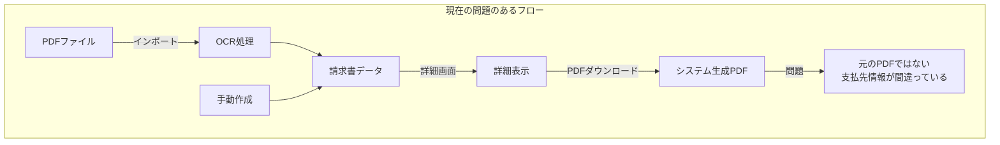
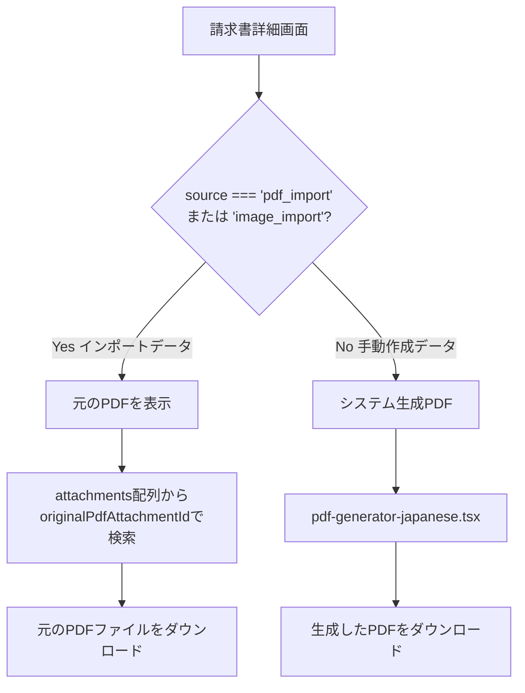
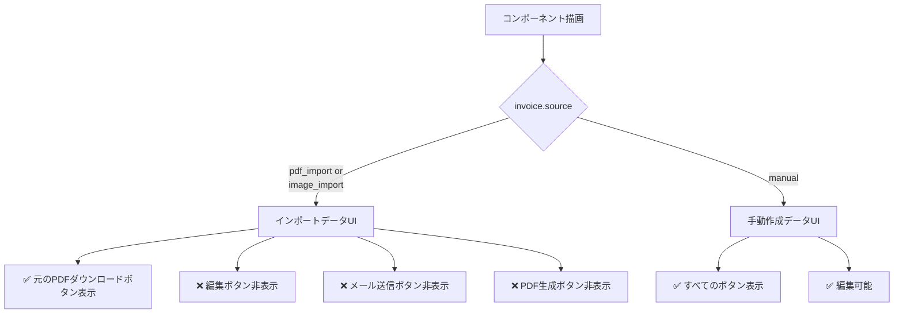

# 請求書データソース分離アーキテクチャ設計書

## 📋 概要

請求書管理システムにおける「インポートデータ」と「手動作成データ」の混在問題を解決するための包括的なアーキテクチャ設計

**ステータス**: 設計完了・実装待ち  
**作成日**: 2025-11-14  
**バージョン**: 1.0.0

---

## 🎯 解決すべき問題

### 1. データの混在問題

**現状の問題:**
- PDFインポートしたデータと手動作成したデータが同じように扱われている
- インポートデータの詳細画面でPDFダウンロードすると、元のPDFではなくシステム生成のPDFが表示される
- 元のPDFの支払先情報が失われ、システム設定のユーザー側支払先情報が表示されてしまう

**データフロー図:**



### 2. ステータス管理の問題

**現状の問題:**
- インポートしたデータのステータスが「下書き(`draft`)」となっており不適切
- 実際にはインポートされた確定データなのに、編集途中のように見える

**型定義 ([`lib/types.ts:2`](lib/types.ts:2)):**
```typescript
export type InvoiceStatus = "paid" | "pending" | "overdue" | "draft"
```

### 3. UI/UXの問題

**現状の問題:**
- インポートデータでもダウンロード・メール送信・編集ボタンが表示される
- ユーザーが誤ってインポートデータを編集してしまう可能性がある
- フィルタで「インポート」データを絞り込めない

**現在のフィルタ ([`components/invoice-list-enhanced.tsx:52-69`](components/invoice-list-enhanced.tsx:52)):**
```tsx
{["all", "paid", "pending", "overdue"].map((status) => (
  // インポートデータを区別するフィルタがない
))}
```

---

## ✅ 設計方針

### 基本原則

1. **データソースの明確な区別**: インポートデータと手動作成データを完全に分離
2. **元のPDFの保持**: インポートしたPDFファイルはそのまま保存し、ダウンロード可能にする
3. **編集不可の徹底**: インポートデータは編集不可とし、UIレベルで制御
4. **ステータスの明確化**: インポートデータには専用ステータス「インポート」を付与

---

## 🏗️ データモデル設計

### 1. ステータス型の拡張

**変更箇所**: [`lib/types.ts:2`](lib/types.ts:2)

**Before:**
```typescript
export type InvoiceStatus = "paid" | "pending" | "overdue" | "draft"
```

**After:**
```typescript
export type InvoiceStatus = 
  | "paid"      // 支払済み
  | "pending"   // 未払い
  | "overdue"   // 期限切れ
  | "draft"     // 下書き
  | "imported"  // インポート（新規追加）
```

### 2. Invoice型の拡張

**既存の構造 ([`lib/types.ts:28-48`](lib/types.ts:28)):**

```typescript
export interface Invoice {
  id: string
  invoiceNumber: string
  client: Client
  issueDate: Date
  dueDate: Date
  lineItems: InvoiceLineItem[]
  subtotal: number
  tax: number
  taxRate: number
  total: number
  status: InvoiceStatus
  paidDate?: Date
  notes?: string
  createdAt: Date
  updatedAt: Date
  source?: InvoiceSource              // 既に存在
  attachments?: InvoiceAttachment[]   // 既に存在
  ocrData?: OCRResult                 // 既に存在
  paymentInfo?: PaymentInfo           // 既に存在
}
```

**新規フラグの追加:**

```typescript
export interface Invoice {
  // ... 既存のフィールド
  
  // 🆕 読み取り専用フラグ（インポートデータの場合true）
  isReadonly?: boolean
  
  // 🆕 元のPDFファイルのID（インポートデータの場合のみ）
  originalPdfAttachmentId?: string
}
```

### 3. InvoiceAttachment型の明確化

**既存の構造 ([`lib/types.ts:51-58`](lib/types.ts:51)):**

```typescript
export interface InvoiceAttachment {
  id: string
  fileName: string
  fileType: string
  fileSize: number
  base64Data: string
  uploadedAt: Date
}
```

**拡張案:**

```typescript
export interface InvoiceAttachment {
  id: string
  fileName: string
  fileType: string  // "application/pdf" | "image/jpeg" | "image/png"
  fileSize: number
  base64Data: string
  uploadedAt: Date
  
  // 🆕 添付ファイルの種類を明確化
  attachmentType?: "original_import" | "generated" | "user_upload"
}
```

---

## 🔧 アーキテクチャ設計

### 1. データソース識別フロー

```mermaid
graph TB
    subgraph "インポートフロー"
        PDF[PDFファイル] -->|アップロード| IMPORT[invoice-import.tsx]
        IMPORT -->|OCR処理| SERVICE[invoice-import-service.ts]
        SERVICE -->|データ構築| BUILD[buildInvoiceFromOCR]
        BUILD -->|設定| FIELDS[source: pdf_import<br/>status: imported<br/>isReadonly: true<br/>originalPdfAttachmentId: xxx]
        FIELDS -->|保存| STORE1[LocalStorage]
    end
    
    subgraph "手動作成フロー"
        MANUAL[手動作成] -->|フォーム入力| CREATE[invoice-create-enhanced.tsx]
        CREATE -->|データ作成| BUILD2[新規請求書]
        BUILD2 -->|設定| FIELDS2[source: manual<br/>status: draft<br/>isReadonly: false]
        FIELDS2 -->|保存| STORE2[LocalStorage]
    end
```



### 2. PDF表示/ダウンロード処理フロー



### 3. UI表示制御フロー



---

## 💻 実装方針

### Phase 1: データモデルの更新

#### 1.1 型定義の更新

**ファイル**: [`lib/types.ts`](lib/types.ts:2)

**変更内容:**
```typescript
// InvoiceStatusにimportedを追加
export type InvoiceStatus = 
  | "paid" 
  | "pending" 
  | "overdue" 
  | "draft"
  | "imported"  // 🆕

// Invoice型にフラグを追加
export interface Invoice {
  // ... 既存フィールド
  isReadonly?: boolean                // 🆕
  originalPdfAttachmentId?: string   // 🆕
}
```

#### 1.2 インポートサービスの更新

**ファイル**: [`lib/invoice-import-service.ts`](lib/invoice-import-service.ts:178)

**変更箇所 (line 178):**

**Before:**
```typescript
status: "draft",
```

**After:**
```typescript
status: "imported",           // 🆕 ステータスを変更
isReadonly: true,             // 🆕 編集不可フラグ
originalPdfAttachmentId: attachment.id,  // 🆕 元のPDFのID
```

### Phase 2: UI/UXの更新

#### 2.1 請求書一覧のフィルタ追加

**ファイル**: [`components/invoice-list-enhanced.tsx`](components/invoice-list-enhanced.tsx:52)

**変更内容 (line 52-69):**

**Before:**
```typescript
{["all", "paid", "pending", "overdue"].map((status) => (
  // ...
))}
```

**After:**
```typescript
{["all", "paid", "pending", "overdue", "imported"].map((status) => (
  <button
    key={status}
    onClick={() => setFilter(status)}
    className={/* ... */}
  >
    {status === "all" ? "すべて" :
     status === "paid" ? "支払済み" :
     status === "pending" ? "未払い" :
     status === "overdue" ? "期限切れ" :
     status === "imported" ? "インポート" : ""} {/* 🆕 */}
  </button>
))}
```

#### 2.2 ステータス表示の更新

**ファイル**: [`components/invoice-detail-enhanced.tsx`](components/invoice-detail-enhanced.tsx:56)

**変更箇所 (line 56-67):**

**Before:**
```typescript
const getStatusText = (status: string) => {
  switch (status) {
    case "paid": return "支払済み"
    case "pending": return "未払い"
    case "overdue": return "期限切れ"
    default: return "下書き"
  }
}
```

**After:**
```typescript
const getStatusText = (status: string) => {
  switch (status) {
    case "paid": return "支払済み"
    case "pending": return "未払い"
    case "overdue": return "期限切れ"
    case "imported": return "インポート"  // 🆕
    default: return "下書き"
  }
}
```

#### 2.3 詳細画面のボタン制御

**ファイル**: [`components/invoice-detail-enhanced.tsx`](components/invoice-detail-enhanced.tsx:185)

**変更箇所 (line 185-202):**

**Before:**
```typescript
<div className="space-y-2">
  <button onClick={() => downloadInvoicePDFJapanese(invoice, settings.company)}>
    PDFダウンロード
  </button>
  <button>メール送信</button>
  <button>編集</button>
</div>
```

**After:**
```typescript
<div className="space-y-2">
  {/* インポートデータの場合は元のPDFをダウンロード */}
  {(invoice.source === "pdf_import" || invoice.source === "image_import") ? (
    <button onClick={() => downloadOriginalPDF(invoice)}>
      <Download size={18} />
      元のPDFダウンロード
    </button>
  ) : (
    <>
      {/* 手動作成データの場合は通常のボタンを表示 */}
      <button onClick={() => downloadInvoicePDFJapanese(invoice, settings.company)}>
        <Download size={18} />
        PDFダウンロード
      </button>
      <button>
        <Send size={18} />
        メール送信
      </button>
      <button>
        <Edit size={18} />
        編集
      </button>
    </>
  )}
</div>
```

### Phase 3: PDF処理の実装

#### 3.1 元のPDFダウンロード関数の実装

**ファイル**: [`components/invoice-detail-enhanced.tsx`](components/invoice-detail-enhanced.tsx:1) (新規関数)

**新規追加:**
```typescript
// 元のPDFをダウンロードする関数
const downloadOriginalPDF = (invoice: Invoice) => {
  // 元のPDFのIDを取得
  const originalAttachmentId = invoice.originalPdfAttachmentId
  
  if (!originalAttachmentId) {
    alert("元のPDFファイルが見つかりません")
    return
  }
  
  // attachments配列から該当のファイルを検索
  const originalAttachment = invoice.attachments?.find(
    att => att.id === originalAttachmentId
  )
  
  if (!originalAttachment) {
    alert("元のPDFファイルが見つかりません")
    return
  }
  
  // Base64データをBlobに変換
  const byteString = atob(originalAttachment.base64Data.split(',')[1])
  const ab = new ArrayBuffer(byteString.length)
  const ia = new Uint8Array(ab)
  for (let i = 0; i < byteString.length; i++) {
    ia[i] = byteString.charCodeAt(i)
  }
  const blob = new Blob([ab], { type: originalAttachment.fileType })
  
  // ダウンロード
  const url = URL.createObjectURL(blob)
  const link = document.createElement("a")
  link.href = url
  link.download = originalAttachment.fileName
  document.body.appendChild(link)
  link.click()
  document.body.removeChild(link)
  URL.revokeObjectURL(url)
}
```

### Phase 4: 支払情報の適切な表示

#### 4.1 詳細画面の支払情報表示ロジック

**ファイル**: [`components/invoice-detail-enhanced.tsx`](components/invoice-detail-enhanced.tsx:204)

**変更箇所 (line 204-229):**

**コンセプト:**
- インポートデータの場合: `invoice.paymentInfo`（元のPDFから抽出した支払先情報）を表示
- 手動作成データの場合: `settings.company`（システム設定の自社情報）を表示

**Before:**
```typescript
<div className="bg-card border border-border rounded-lg p-6">
  <p className="text-sm text-muted-foreground mb-4 font-semibold">支払情報</p>
  <div className="space-y-3 text-sm">
    <div>
      <p className="text-muted-foreground">銀行振込先</p>
      <p className="font-semibold text-foreground">
        {invoice.paymentInfo?.bankName || settings.company.bankName} {invoice.paymentInfo?.branchName || settings.company.branchName}
      </p>
    </div>
    {/* ... */}
  </div>
</div>
```

**After:**
```typescript
<div className="bg-card border border-border rounded-lg p-6">
  <p className="text-sm text-muted-foreground mb-4 font-semibold">支払情報</p>
  
  {/* インポートデータの場合は元のPDFの支払先情報を表示 */}
  {(invoice.source === "pdf_import" || invoice.source === "image_import") && invoice.paymentInfo ? (
    <div className="space-y-3 text-sm">
      <div className="bg-blue-50 p-3 rounded mb-3">
        <p className="text-xs text-blue-800">
          ※ インポートされたPDFの支払先情報
        </p>
      </div>
      <div>
        <p className="text-muted-foreground">銀行振込先</p>
        <p className="font-semibold text-foreground">
          {invoice.paymentInfo.bankName} {invoice.paymentInfo.branchName}
        </p>
      </div>
      <div>
        <p className="text-muted-foreground">口座種別</p>
        <p className="font-semibold text-foreground">{invoice.paymentInfo.accountType}</p>
      </div>
      <div>
        <p className="text-muted-foreground">口座番号</p>
        <p className="font-semibold text-foreground">{invoice.paymentInfo.accountNumber}</p>
      </div>
      {invoice.paymentInfo.accountHolder && (
        <div>
          <p className="text-muted-foreground">口座名義</p>
          <p className="font-semibold text-foreground">{invoice.paymentInfo.accountHolder}</p>
        </div>
      )}
    </div>
  ) : (
    /* 手動作成データの場合はシステム設定の自社情報を表示 */
    <div className="space-y-3 text-sm">
      <div>
        <p className="text-muted-foreground">銀行振込先</p>
        <p className="font-semibold text-foreground">
          {settings.company.bankName} {settings.company.branchName}
        </p>
      </div>
      <div>
        <p className="text-muted-foreground">口座種別</p>
        <p className="font-semibold text-foreground">{settings.company.accountType}</p>
      </div>
      <div>
        <p className="text-muted-foreground">口座番号</p>
        <p className="font-semibold text-foreground">{settings.company.accountNumber}</p>
      </div>
    </div>
  )}
</div>
```

---

## 📋 実装チェックリスト

### データモデル

- [ ] [`lib/types.ts`](lib/types.ts:2): `InvoiceStatus`に`"imported"`を追加
- [ ] [`lib/types.ts`](lib/types.ts:28): `Invoice`型に`isReadonly?: boolean`を追加
- [ ] [`lib/types.ts`](lib/types.ts:28): `Invoice`型に`originalPdfAttachmentId?: string`を追加

### サービス層

- [ ] [`lib/invoice-import-service.ts`](lib/invoice-import-service.ts:47): インポート時に`source`を設定
- [ ] [`lib/invoice-import-service.ts`](lib/invoice-import-service.ts:178): ステータスを`"imported"`に変更
- [ ] [`lib/invoice-import-service.ts`](lib/invoice-import-service.ts:178): `isReadonly: true`を設定
- [ ] [`lib/invoice-import-service.ts`](lib/invoice-import-service.ts:47): `originalPdfAttachmentId`を設定

### UI層 - 一覧画面

- [ ] [`components/invoice-list-enhanced.tsx`](components/invoice-list-enhanced.tsx:52): フィルタに`"imported"`を追加
- [ ] [`components/invoice-list-enhanced.tsx`](components/invoice-list-enhanced.tsx:26): `getStatusText`関数に`"imported"`ケースを追加
- [ ] [`components/invoice-list-enhanced.tsx`](components/invoice-list-enhanced.tsx:93): ステータスバッジに`"imported"`のスタイルを追加

### UI層 - 詳細画面

- [ ] [`components/invoice-detail-enhanced.tsx`](components/invoice-detail-enhanced.tsx:56): `getStatusText`関数に`"imported"`ケースを追加
- [ ] [`components/invoice-detail-enhanced.tsx`](components/invoice-detail-enhanced.tsx:43): `getStatusBadge`関数に`"imported"`のスタイルを追加
- [ ] [`components/invoice-detail-enhanced.tsx`](components/invoice-detail-enhanced.tsx:185): ボタン表示をデータソースで分岐
- [ ] [`components/invoice-detail-enhanced.tsx`](components/invoice-detail-enhanced.tsx:1): `downloadOriginalPDF`関数を実装
- [ ] [`components/invoice-detail-enhanced.tsx`](components/invoice-detail-enhanced.tsx:204): 支払情報の表示ロジックを分岐

### UI層 - インポート画面

- [ ] [`components/invoice-import.tsx`](components/invoice-import.tsx:110): インポート確認時のメッセージを更新

---

## 🔄 移行戦略

### 既存データの扱い

**方針**: 既存のインポートデータは少ないため、手動で対応する

**手順**:
1. 実装完了後、既存のインポートデータ（`source: "pdf_import"` または `"image_import"`）を確認
2. 必要に応じて、手動で`status`を`"imported"`に更新
3. `isReadonly`フラグを`true`に設定
4. 元のPDFファイルがある場合は`originalPdfAttachmentId`を設定

### 段階的リリース

**Phase 1**: データモデルとサービス層の更新
- 新規インポートデータが正しく`status: "imported"`で保存されることを確認

**Phase 2**: UI層の更新（一覧画面）
- フィルタ機能とステータス表示の更新

**Phase 3**: UI層の更新（詳細画面）
- ボタン制御とPDFダウンロード機能の実装

**Phase 4**: 既存データの移行
- 必要に応じて既存データを更新

---

## ⚠️ 注意点と考慮事項

### 1. Base64データのサイズ

**問題**: PDFファイルをBase64でLocalStorageに保存すると容量を圧迫する

**対策**:
- 画像インポートの場合は最大1MB以下に圧縮
- PDFの場合は元のサイズを維持（ファイルサイズ制限を設ける）
- 容量警告UIの実装を検討

### 2. パフォーマンス

**問題**: 大量のインポートデータで一覧表示が遅くなる可能性

**対策**:
- ページネーションの実装
- 仮想スクロールの導入を検討
- フィルタリングの最適化

### 3. データ整合性

**問題**: `originalPdfAttachmentId`が指すファイルが削除される可能性

**対策**:
- 添付ファイル削除時に関連する請求書をチェック
- インポートデータの元のPDFは削除不可にする
- データ検証機能の実装

### 4. ユーザビリティ

**問題**: インポートデータと手動作成データの違いがわかりにくい可能性

**対策**:
- 一覧画面でアイコンやバッジで視覚的に区別
- 詳細画面でインポート元の情報を表示
- ツールチップやヘルプテキストの追加

---

## 📊 実装の影響範囲

### 変更が必要なファイル

| ファイル | 変更内容 | 影響度 |
|---------|---------|--------|
| [`lib/types.ts`](lib/types.ts:2) | 型定義の追加・更新 | 🔴 高 |
| [`lib/invoice-import-service.ts`](lib/invoice-import-service.ts:178) | インポートロジックの更新 | 🔴 高 |
| [`components/invoice-list-enhanced.tsx`](components/invoice-list-enhanced.tsx:52) | フィルタとステータス表示 | 🟡 中 |
| [`components/invoice-detail-enhanced.tsx`](components/invoice-detail-enhanced.tsx:56) | ボタン制御とPDF処理 | 🔴 高 |
| [`components/invoice-import.tsx`](components/invoice-import.tsx:110) | インポート確認メッセージ | 🟢 低 |

### 変更が不要なファイル

- [`lib/store.tsx`](lib/store.tsx:1): データ構造の変更は後方互換性あり
- [`lib/pdf-generator-japanese.tsx`](lib/pdf-generator-japanese.tsx:1): 手動作成データのPDF生成は変更なし
- [`lib/ocr-processor.ts`](lib/ocr-processor.ts:1): OCR処理ロジックは変更なし

---

## 🎨 UI設計案

### ステータスバッジのカラー

```typescript
const getStatusBadge = (status: InvoiceStatus) => {
  switch (status) {
    case "paid":
      return "bg-green-100 text-green-800"
    case "pending":
      return "bg-yellow-100 text-yellow-800"
    case "overdue":
      return "bg-red-100 text-red-800"
    case "imported":  // 🆕
      return "bg-blue-100 text-blue-800"
    default:
      return "bg-gray-100 text-gray-800"
  }
}
```

### インポートデータ表示の視覚的区別

```tsx
{/* 一覧画面でのアイコン表示例 */}
<div className="flex items-center gap-2">
  {invoice.source === "pdf_import" && (
    <FileText className="text-blue-500" size={16} />
  )}
  {invoice.source === "image_import" && (
    <Image className="text-blue-500" size={16} />
  )}
  <span>{invoice.invoiceNumber}</span>
</div>
```

---

## 🧪 テストシナリオ

### 1. インポートデータの作成

- [ ] PDFをインポートし、ステータスが「インポート」になることを確認
- [ ] 画像をインポートし、ステータスが「インポート」になることを確認
- [ ] `isReadonly`が`true`に設定されることを確認
- [ ] `originalPdfAttachmentId`が正しく設定されることを確認

### 2. 一覧画面のフィルタ

- [ ] 「インポート」フィルタでインポートデータのみ表示されることを確認
- [ ] 「すべて」フィルタでインポートデータも含めて表示されることを確認
- [ ] ステータスバッジが正しく表示されることを確認

### 3. 詳細画面の表示

- [ ] インポートデータで「元のPDFダウンロード」ボタンが表示されることを確認
- [ ] インポートデータで編集・メール送信ボタンが非表示になることを確認
- [ ] 手動作成データで通常のボタンが表示されることを確認

### 4. PDFダウンロード

- [ ] インポートデータで元のPDFが正しくダウンロードされることを確認
- [ ] 手動作成データでシステム生成PDFが正しくダウンロードされることを確認

### 5. 支払情報の表示

- [ ] インポートデータで元のPDFの支払先情報が表示されることを確認
- [ ] 手動作成データでシステム設定の自社情報が表示されることを確認

---

## 📈 将来の拡張案

### 1. バッチ処理

- 複数のインポートデータを一括で処理
- インポート履歴の管理

### 2. データ検証

- インポートデータの整合性チェック
- 重複チェック機能

### 3. エクスポート機能

- インポートデータのみをCSVエクスポート
- 元のPDFファイルの一括ダウンロード

### 4. 権限管理

- インポートデータの閲覧権限
- 管理者のみインポートデータを削除可能

---

## 🔗 関連ドキュメント

- [請求書読み込み機能 - アーキテクチャ設計書](INVOICE_IMPORT_ARCHITECTURE.md)
- [PDF生成アーキテクチャ - 日本語対応ソリューション](PDF_ARCHITECTURE.md)

---

**作成者**: AI Architect  
**レビュー状態**: 承認待ち  
**次のアクション**: ユーザー承認後、Code モードで実装開始